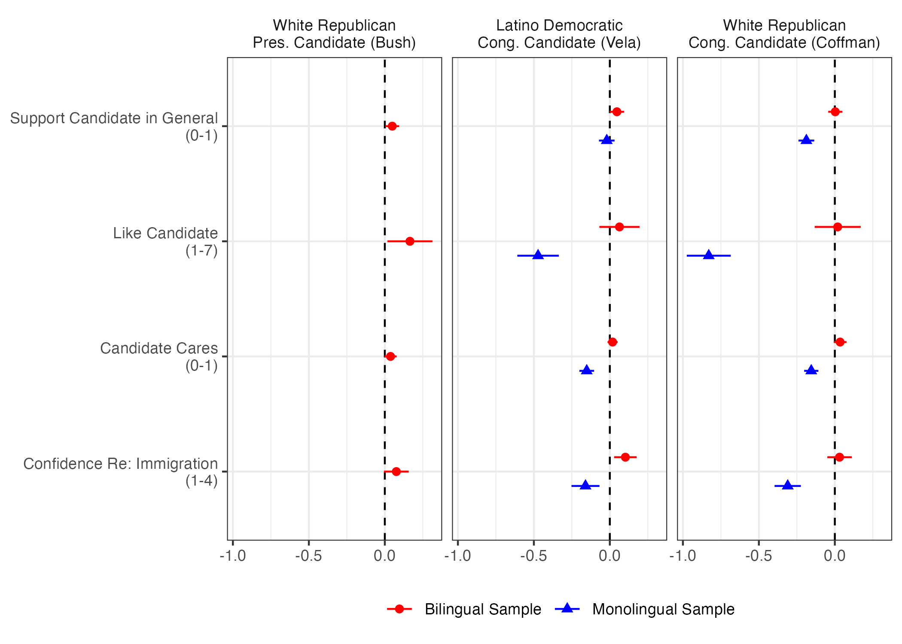
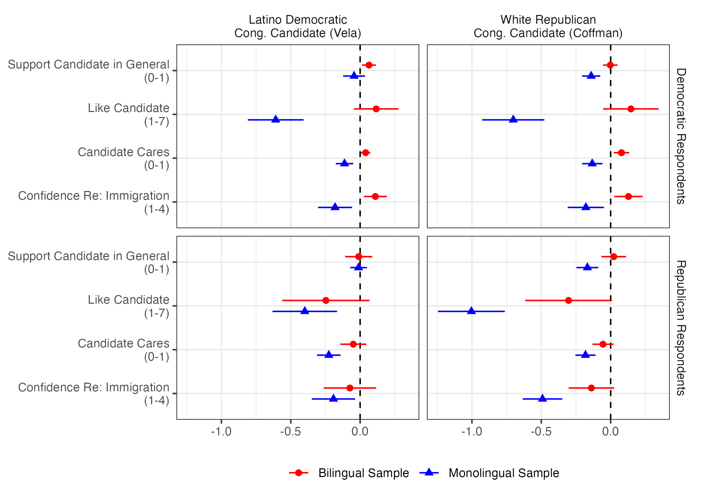
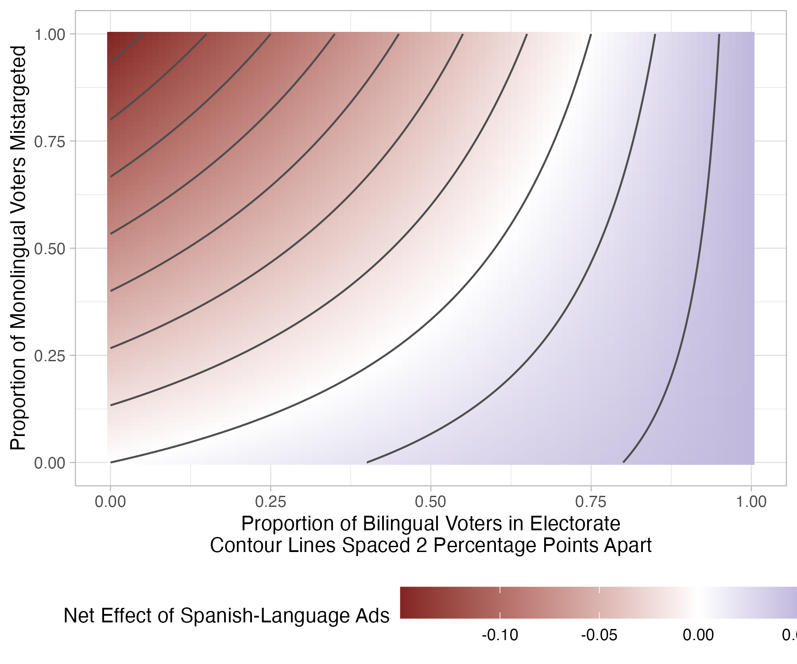

# Reproducibility Report: Flores and Coppock (2018)


- [Summary](#summary)
  - [Does the deposited archive run?](#does-the-deposited-archive-run)
  - [Does the maintained rewrite reproduce the
    paper?](#does-the-maintained-rewrite-reproduce-the-paper)
- [Paper overview](#paper-overview)
- [Original archive reproducibility](#original-archive-reproducibility)
  - [The archive overwrites itself](#the-archive-overwrites-itself)
- [Number-by-number comparison](#number-by-number-comparison)
- [Table 2 has no code](#table-2-has-no-code)
- [Maintained rewrite](#maintained-rewrite)
  - [Architecture](#architecture)
  - [Deprecated patterns replaced](#deprecated-patterns-replaced)
- [Figures](#figures)
- [The extraction and the two
  instruments](#the-extraction-and-the-two-instruments)
- [Errata](#errata)
- [In-text claims](#in-text-claims)
- [Maintained rewrite verification](#maintained-rewrite-verification)
- [R environment](#r-environment)

*Drafted by Claude Opus 5 under the supervision of Alex Coppock.*

This repository holds the actively maintained replication code for
Flores and Coppock (2018), together with the reproducibility report that
documents what the original archive did and did not do. It is part of a
program applying the maintenance proposal in Peer, Orr and Coppock
(2021, *PS: Political Science & Politics*, doi
[10.1017/S1049096521000366](https://doi.org/10.1017/S1049096521000366))
to a set of published archives.

|  |  |
|----|----|
| Article | [10.1080/10584609.2018.1426663](https://doi.org/10.1080/10584609.2018.1426663) |
| Replication archive | [10.7910/DVN/XGQ2ZA](https://doi.org/10.7910/DVN/XGQ2ZA) |
| Pre-analysis plans | [osf.io/e6zjk](https://osf.io/e6zjk) |

**The data are not redistributed here.** The deposit is 3.7 MB across 14
files and lives at Harvard Dataverse, which is the only copy this
repository points at. `download_original.R` fetches it and verifies
every file; `original_manifest.csv` pins the file identifiers, sizes and
checksums, so the exact bytes this code was written against are recorded
in version control even though the bytes themselves are not.

**Repository layout.** `maintained/` is the maintained rewrite: one
script per published table or figure, writing to `output/`, which is
committed so a reader can compare a fresh run against it without
downloading anything. `ground_truth/` ties every published number to the
code that produces it. `original/` is created by the download script and
is deliberately absent from the repository. This file is the
reproducibility report, also available as a PDF in `report/`.

**License.** CC0 1.0 Universal, matching the terms of the deposit this
repository maintains. See `LICENSE`.

**To reproduce.** Clone or download the repository, open
`flores_coppock_2018.Rproj`, and run:

``` r
source("run_all.R")
```

That fetches the deposit, verifies its 14 files, produces every table
and figure into `maintained/output/`, and rebuilds the ground truth from
what it wrote. Required packages: tidyverse, estimatr, marginaleffects,
knitr, kableExtra, here. Paths resolve through `here`, so nothing
depends on the working directory. The full run takes about ten seconds
once the deposit is on disk. A successful run overwrites
`maintained/output/`, which is committed: **`git diff` on that folder is
the reproduction check.**

## Summary

Two questions, answered before the detail.

### Does the deposited archive run?

Yes. All eight R scripts execute without error on R 4.6.0, with no
hardcoded paths beyond a commented instruction to set the working
directory and no calls that have since been removed. Every package they
name still installs from CRAN, and all of them are alive: `margins`
0.3.28 was released in July 2024, `ggstance` 0.3.7 in April 2024,
`coefplot` 1.2.9 in September 2025. The archive’s own README omits
`margins` from its list of dependencies, which is the only thing
standing between a fresh session and a clean run, and it installs in one
line.

Running is also reproducing. The ground truth holds 624 rows, 530 of
which pair a published value with a value a deposited script prints.
Every one of those 530 matches the article to the precision it reports.
There are no exceptions: not one coefficient, standard error, sample
size, log likelihood or AIC in the article or its appendix disagrees
with what the deposited code produces eight years later.

Two things are nonetheless wrong with the deposit, and neither shows up
as an error.

**Running the archive in place destroys part of it.** Both figure
scripts end in `ggsave(filename = "flores_coppock_figure_1.pdf", ...)`
with a bare relative path, and both of those PDFs are themselves
deposited files. A reader who does what the scripts instruct, setting
the working directory to the archive folder and sourcing them,
overwrites two of the fourteen deposited files and adds a stray
`Rplots.pdf`. Nothing about the result changes, since the re-rendered
figures carry the same estimates; what changes is that the deposit no
longer verifies against its own published checksums.

**The README undercounts the archive.** It lists seven scripts and
describes the archive as containing them. There are eight.
`FC_bilinguals_simulation.R`, which draws Figure 3, appears nowhere in
it.

### Does the maintained rewrite reproduce the paper?

Every number the article prints reproduces. Of the 600 claims carrying a
published value, 594 match it to the precision the article reports. That
includes the 17 values of Table 2 that no deposited script computes,
which the rewrite recovers from the deposited `study_1.csv`.

The 6 that do not match are not estimates. They are the endpoints the
article gives for two of its five outcome scales, which it describes as
running from 1 to 4 where the analysed variables run from 0 to 3. Three
further claims are prose that the data contradict: each of three
references to a lettered appendix section names the wrong section. All 9
are errors in the article rather than in the code, they move no estimate
and no conclusion, and they are corrected in
`flores_coppock_2018_errata.pdf` at the root of this repository.

The rewrite contains exactly two numbers not computed from data, `0.05`
and `-0.15` in `figure_3_simulation.R`. They are not estimates. They are
the supposition the article states on page 18 in order to draw Figure 3:
“Suppose for the moment that the positive effect among bilinguals is 5
percentage points but the effect among English-only monolinguals is
negative 15 percentage points.” Every other value in
`maintained/output/` traces to the deposited data.

## Paper overview

**Citation**: Flores, A. and Coppock, A. (2018). “Do bilinguals respond
more favorably to candidate advertisements in English or in Spanish?”
*Political Communication*, 35(4), 612-633. DOI:
10.1080/10584609.2018.1426663

**Summary**: Three survey experiments ask whether a candidate gains by
speaking Spanish to bilingual voters, and what it costs when the same
appeal reaches people who do not speak Spanish. Each uses a real
advertisement produced by the campaign in matched English and Spanish
versions, so the language of the appeal varies while its content does
not: Jeb Bush in the 2016 Republican presidential primary, Filemon Vela
running for Congress in Texas, and Mike Coffman running for Congress in
Colorado. Experiments 1 and 2 add a second randomized factor, the
language of the survey itself, giving a 2 by 2 design among bilinguals;
Experiment 3 fields the Vela and Coffman ads to English-speaking
monolinguals, where only the ad language varies. Among bilinguals the
Spanish ad raises general election support for Bush and for Vela by
about 5 percentage points and does nothing for Coffman. Among
monolinguals the sign flips and the magnitude grows: support for Coffman
falls 18.7 points. Taking the survey in Spanish raises bilinguals’
reported sense of linked fate with other Latinos.

## Original archive reproducibility

| Script | Produces | Status on current R |
|:---|:---|:---|
| FC_bilinguals_main_analysis.R | Tables 5 to 9 | Clean |
| FC_bilinguals_in_text_stats.R | Table 3 | Clean |
| FC_bilinguals_interaction_analysis.R | Tables A.1 to A.4 | Clean |
| FC_bilinguals_pid_analysis.R | Tables B.5 to B.8 | Clean |
| FC_bilinguals_logit_analysis.R | Tables C.9 and C.10 | Clean once margins is installed; the README does not name it |
| FC_bilinguals_figure_1.R | Figure 1 | Clean; geom_errorbarh() warns that it is deprecated; overwrites a deposited file |
| FC_bilinguals_figure_2.R | Figure 2 | Clean; same deprecation warning; overwrites a deposited file |
| FC_bilinguals_simulation.R | Figure 3 | Clean; absent from the README |

Original archive reproducibility, checked against R 4.6.0 on 1 August
2026.

Every package the archive names installs from CRAN and every one of them
has been updated within the last two years: `stargazer` 5.2.3,
`estimatr` 1.0.6, `coefplot` 1.2.9, `ggstance` 0.3.7, `margins` 0.3.28,
`tidyverse`, `scales`. The only calls that draw a warning are
`geom_errorbarh()` in the two figure scripts, deprecated in ggplot2
4.0.0 in favour of `geom_errorbar(orientation = "y")`, and
`ggstance::position_dodgev()`, which warns about overlapping intervals
as it always has. Both still draw the figure correctly.

### The archive overwrites itself

The two figure scripts finish with

``` r
ggsave(filename = "flores_coppock_figure_1.pdf", g, width = 7, height = 5)
```

and `flores_coppock_figure_1.pdf` is one of the fourteen files in the
deposit. Running the archive as its own comments instruct therefore
replaces two deposited files with fresh renderings and leaves a
`Rplots.pdf` behind. Verifying the four affected checksums is the only
way to notice, since the output is correct and no error is raised.

| File | MD5 as deposited | After one run in place |
|:---|:---|:---|
| flores_coppock_figure_1.pdf | f382d6ec39e490d6bf47f9259781ea37 | differs, and differs again on every run |
| flores_coppock_figure_2.pdf | a4de3cc99fbe1147ef702f18e21024fe | differs, and differs again on every run |
| Rplots.pdf | not in the deposit | created |

What a single in-place run of the archive changes.

No fixed checksum can be quoted for the overwritten files, because a PDF
records the time it was written and so hashes differently on every run.
What can be quoted is how far the new rendering is from the old one. The
re-rendered figures are not pixel-identical either, since ggplot2’s text
metrics have moved since 2017; rasterized at 100 dpi, mean absolute
pixel intensity differs by 0.9 percent for Figure 1 and 2.4 percent for
Figure 2. The difference is confined to glyph rendering and the small
shift in panel geometry that follows from it. The plotted estimates are
the same. This is damage to the archive’s verifiability, not to its
result.

`download_original.R` restores the deposit from Dataverse and checks all
fourteen files, so the damage is recoverable for anyone who notices it.
The lesson generalizes past this archive: run a deposit’s scripts in a
copy, never in the deposit.

## Number-by-number comparison

| Location | Claims | In archive output | Archive matches | Archive fails | Rewrite matches | Rewrite fails |
|:---|---:|---:|---:|---:|---:|---:|
| table_1 | 1 | 0 | 0 | 0 | 0 | 0 |
| table_2 | 17 | 0 | 0 | 0 | 17 | 0 |
| table_3 | 16 | 16 | 16 | 0 | 16 | 0 |
| table_4 | 1 | 0 | 0 | 0 | 0 | 0 |
| table_5 | 31 | 31 | 31 | 0 | 31 | 0 |
| table_6 | 31 | 31 | 31 | 0 | 31 | 0 |
| table_7 | 31 | 31 | 31 | 0 | 31 | 0 |
| table_8 | 31 | 31 | 31 | 0 | 31 | 0 |
| table_9 | 10 | 10 | 10 | 0 | 10 | 0 |
| figure_1 | 3 | 0 | 0 | 0 | 2 | 0 |
| figure_2 | 4 | 0 | 0 | 0 | 3 | 0 |
| figure_3 | 2 | 0 | 0 | 0 | 0 | 0 |
| table_a1 | 27 | 27 | 27 | 0 | 27 | 0 |
| table_a2 | 27 | 27 | 27 | 0 | 27 | 0 |
| table_a3 | 27 | 27 | 27 | 0 | 27 | 0 |
| table_a4 | 27 | 27 | 27 | 0 | 27 | 0 |
| table_b5 | 40 | 40 | 40 | 0 | 40 | 0 |
| table_b6 | 40 | 40 | 40 | 0 | 40 | 0 |
| table_b7 | 40 | 40 | 40 | 0 | 40 | 0 |
| table_b8 | 40 | 40 | 40 | 0 | 40 | 0 |
| table_c9 | 41 | 41 | 41 | 0 | 41 | 0 |
| table_c10 | 41 | 41 | 41 | 0 | 41 | 0 |
| text | 96 | 30 | 30 | 0 | 72 | 6 |

Published values by table, against the deposited scripts and against the
maintained rewrite.

The ground truth records 624 rows: every coefficient, standard error,
sample size, log likelihood and AIC in Tables 2, 3 and 5 through 9 and
in appendix Tables A.1 through C.10, the sixteen cell counts of Table 3,
every quantity the article states in a sentence rather than in a table,
and one row for each published float that carries no comparable number,
so that a float’s absence can never be mistaken for a float that was
checked and passed. The typeset tables were extracted from the article
and appendix PDFs by parsing rather than by transcription, so that side
of the comparison is exhaustive rather than selective; the extraction
scripts are in `ground_truth/`.

`value_paper` is carried as the string the page prints, and a value
agrees when the pipeline’s number, printed to that page’s own precision,
gives the same digits. The distinction is not cosmetic: 54 of the
published values end in a decimal zero that a numeric column silently
drops, turning Table 5’s standard error of 0.020 into 0.02 and comparing
it at a tenth of the intended tolerance.

70 published quantities are not printed by any deposited script: the 17
values of the Lucid column of Table 2, discussed below, and 53
quantities the article states in prose, mostly recruitment and
quiz-passing counts that the deposit records in its data but never
reports.

`ground_truth/build_ground_truth.R` rebuilds the table at the end of
every run. Its only hardcoded inputs are the published values, which
serve as comparison targets; `value_rewrite` is read back out of
`maintained/output/`, so the table cannot drift from the code it grades.
`defect_locus` records, for every row that is not a clean match, whether
the fault lies with the article, the deposited code, the environment or
this repository. 10 rows carry one: 9 are the article, and the remaining
1 is a claim the deposit never computed.

Five published floats carry no number that can be compared against the
article, and each has a row saying why.

| Float | Why there is nothing in it to compare |
|:---|:---|
| table_1 | Notation rather than results. The table sets out the potential outcomes of bilingual, Spanish-only, English-only and neither-language subjects under the control, English-ad and Spanish-ad conditions. Its eight numeric cells are the two language indicators for each of its four rows; the potential outcomes themselves are symbols. |
| table_4 | The advertisement titles, running times, YouTube links and full transcripts in English and Spanish for all three candidates. Its nine numbers are six running times and three election years, none of which the deposit records. |
| figure_1 | The published figure prints no numbers, so there is nothing in it to compare against the article. All 20 plotted estimates agree with the deposit’s own models on all four quantities, to within 0. |
| figure_2 | As Figure 1. All 32 plotted estimates agree with the deposit’s own models on all four quantities, to within 0. |
| figure_3 | A calibration exercise rather than an estimate: the net effect of a Spanish-language strategy over the share of bilinguals in the electorate and the risk of mistargeting, holding the two effects at the values the article supposes on page 18. The surface is deterministic given those two numbers, and the rewrite writes 132 of its values to figure_3_simulation.csv. |

Published floats with no comparable number.

| Location | Claim | Paper | Archive | Match | Rewrite | Match |
|:---|:---|:---|:---|:---|:---|:---|
| table_1 | Potential outcomes of four subject types |  |  |  |  |  |
| table_2 | lucid, age | 34.80 |  |  | 34.8 | 1 |
| table_2 | lucid, age_se | 0.30 |  |  | 0.3029 | 1 |
| table_2 | lucid, cuban | 0.07 |  |  | 0.07411 | 1 |
| table_2 | lucid, cuban_se | 0.01 |  |  | 0.006072 | 1 |
| table_2 | lucid, education_5 | 3.01 |  |  | 3.005 | 1 |
| table_2 | lucid, education_5_se | 0.03 |  |  | 0.0251 | 1 |
| table_2 | lucid, female | 0.70 |  |  | 0.7003 | 1 |
| table_2 | lucid, female_se | 0.01 |  |  | 0.01062 | 1 |
| table_2 | lucid, income_7 | 4.11 |  |  | 4.109 | 1 |
| table_2 | lucid, income_7_se | 0.05 |  |  | 0.05344 | 1 |
| table_2 | lucid, income_9 | 4.49 |  |  | 4.489 | 1 |
| table_2 | lucid, income_9_se | 0.05 |  |  | 0.05204 | 1 |
| table_2 | lucid, mexican | 0.49 |  |  | 0.4909 | 1 |
| table_2 | lucid, mexican_se | 0.01 |  |  | 0.01159 | 1 |
| table_2 | lucid, n | 1862 |  |  | 1862 | 1 |
| table_2 | lucid, other_hispanic | 0.44 |  |  | 0.435 | 1 |
| table_2 | lucid, other_hispanic_se | 0.01 |  |  | 0.01149 | 1 |
| table_3 | experiment_1_bush_bilingual_english_survey, english_ad | 462 | 462 | 1 | 462 | 1 |
| table_3 | experiment_1_bush_bilingual_english_survey, spanish_ad | 488 | 488 | 1 | 488 | 1 |
| table_3 | experiment_1_bush_bilingual_spanish_survey, english_ad | 452 | 452 | 1 | 452 | 1 |
| table_3 | experiment_1_bush_bilingual_spanish_survey, spanish_ad | 460 | 460 | 1 | 460 | 1 |
| table_3 | experiment_2_vela_bilingual_english_survey, english_ad | 437 | 437 | 1 | 437 | 1 |
| table_3 | experiment_2_vela_bilingual_english_survey, spanish_ad | 442 | 442 | 1 | 442 | 1 |
| table_3 | experiment_2_vela_bilingual_spanish_survey, english_ad | 420 | 420 | 1 | 420 | 1 |
| table_3 | experiment_2_vela_bilingual_spanish_survey, spanish_ad | 382 | 382 | 1 | 382 | 1 |
| table_3 | experiment_2_vela_monolingual_english_survey, english_ad | 675 | 675 | 1 | 675 | 1 |
| table_3 | experiment_2_vela_monolingual_english_survey, spanish_ad | 669 | 669 | 1 | 669 | 1 |
| table_3 | experiment_3_coffman_bilingual_english_survey, english_ad | 455 | 455 | 1 | 455 | 1 |
| table_3 | experiment_3_coffman_bilingual_english_survey, spanish_ad | 424 | 424 | 1 | 424 | 1 |
| table_3 | experiment_3_coffman_bilingual_spanish_survey, english_ad | 421 | 421 | 1 | 421 | 1 |
| table_3 | experiment_3_coffman_bilingual_spanish_survey, spanish_ad | 381 | 381 | 1 | 381 | 1 |
| table_3 | experiment_3_coffman_monolingual_english_survey, english_ad | 711 | 711 | 1 | 711 | 1 |
| table_3 | experiment_3_coffman_monolingual_english_survey, spanish_ad | 633 | 633 | 1 | 633 | 1 |
| table_4 | Advertisement treatments |  |  |  |  |  |
| table_5 | bush_bilingual, N | 1849 | 1849 | 1 | 1849 | 1 |
| table_5 | bush_bilingual, Z_ad | 0.049 | 0.049 | 1 | 0.04897 | 1 |
| table_5 | bush_bilingual, Z_ad_se | 0.023 | 0.023 | 1 | 0.02322 | 1 |
| table_5 | bush_bilingual, Z_survey | 0.005 | 0.005 | 1 | 0.005415 | 1 |
| table_5 | bush_bilingual, Z_survey_se | 0.023 | 0.023 | 1 | 0.02323 | 1 |
| table_5 | bush_bilingual, constant | 0.449 | 0.449 | 1 | 0.4495 | 1 |
| table_5 | bush_bilingual, constant_se | 0.020 | 0.02 | 1 | 0.02009 | 1 |
| table_5 | coffman_bilingual, N | 1681 | 1681 | 1 | 1681 | 1 |
| table_5 | coffman_bilingual, Z_ad | 0.003 | 0.003 | 1 | 0.002706 | 1 |
| table_5 | coffman_bilingual, Z_ad_se | 0.024 | 0.024 | 1 | 0.02362 | 1 |
| table_5 | coffman_bilingual, Z_survey | -0.028 | -0.028 | 1 | -0.02779 | 1 |
| table_5 | coffman_bilingual, Z_survey_se | 0.024 | 0.024 | 1 | 0.02361 | 1 |
| table_5 | coffman_bilingual, constant | 0.384 | 0.384 | 1 | 0.3844 | 1 |
| table_5 | coffman_bilingual, constant_se | 0.020 | 0.02 | 1 | 0.02013 | 1 |
| table_5 | coffman_monolingual, N | 1343 | 1343 | 1 | 1343 | 1 |
| table_5 | coffman_monolingual, Z_ad | -0.187 | -0.187 | 1 | -0.1872 | 1 |
| table_5 | coffman_monolingual, Z_ad_se | 0.026 | 0.026 | 1 | 0.02645 | 1 |
| table_5 | coffman_monolingual, constant | 0.513 | 0.513 | 1 | 0.5127 | 1 |
| table_5 | coffman_monolingual, constant_se | 0.019 | 0.019 | 1 | 0.01877 | 1 |
| table_5 | vela_bilingual, N | 1680 | 1680 | 1 | 1680 | 1 |
| table_5 | vela_bilingual, Z_ad | 0.049 | 0.049 | 1 | 0.04855 | 1 |
| table_5 | vela_bilingual, Z_ad_se | 0.024 | 0.024 | 1 | 0.0239 | 1 |
| table_5 | vela_bilingual, Z_survey | 0.073 | 0.073 | 1 | 0.07296 | 1 |
| table_5 | vela_bilingual, Z_survey_se | 0.024 | 0.024 | 1 | 0.0239 | 1 |
| table_5 | vela_bilingual, constant | 0.535 | 0.535 | 1 | 0.5348 | 1 |
| table_5 | vela_bilingual, constant_se | 0.021 | 0.021 | 1 | 0.02072 | 1 |
| table_5 | vela_monolingual, N | 1343 | 1343 | 1 | 1343 | 1 |
| table_5 | vela_monolingual, Z_ad | -0.020 | -0.02 | 1 | -0.02012 | 1 |
| table_5 | vela_monolingual, Z_ad_se | 0.026 | 0.026 | 1 | 0.02614 | 1 |
| table_5 | vela_monolingual, constant | 0.366 | 0.366 | 1 | 0.3659 | 1 |
| table_5 | vela_monolingual, constant_se | 0.019 | 0.019 | 1 | 0.01855 | 1 |
| table_6 | bush_bilingual, N | 1862 | 1862 | 1 | 1862 | 1 |
| table_6 | bush_bilingual, Z_ad | 0.167 | 0.167 | 1 | 0.1668 | 1 |
| table_6 | bush_bilingual, Z_ad_se | 0.075 | 0.075 | 1 | 0.07533 | 1 |
| table_6 | bush_bilingual, Z_survey | 0.165 | 0.165 | 1 | 0.165 | 1 |
| table_6 | bush_bilingual, Z_survey_se | 0.075 | 0.075 | 1 | 0.07546 | 1 |
| table_6 | bush_bilingual, constant | 4.810 | 4.81 | 1 | 4.81 | 1 |
| table_6 | bush_bilingual, constant_se | 0.063 | 0.063 | 1 | 0.06343 | 1 |
| table_6 | coffman_bilingual, N | 1680 | 1680 | 1 | 1680 | 1 |
| table_6 | coffman_bilingual, Z_ad | 0.019 | 0.019 | 1 | 0.01945 | 1 |
| table_6 | coffman_bilingual, Z_ad_se | 0.077 | 0.077 | 1 | 0.07728 | 1 |
| table_6 | coffman_bilingual, Z_survey | 0.093 | 0.093 | 1 | 0.09271 | 1 |
| table_6 | coffman_bilingual, Z_survey_se | 0.078 | 0.078 | 1 | 0.07773 | 1 |
| table_6 | coffman_bilingual, constant | 4.902 | 4.902 | 1 | 4.902 | 1 |
| table_6 | coffman_bilingual, constant_se | 0.066 | 0.066 | 1 | 0.06603 | 1 |
| table_6 | coffman_monolingual, N | 1342 | 1342 | 1 | 1342 | 1 |
| table_6 | coffman_monolingual, Z_ad | -0.830 | -0.83 | 1 | -0.8299 | 1 |
| table_6 | coffman_monolingual, Z_ad_se | 0.074 | 0.074 | 1 | 0.07376 | 1 |
| table_6 | coffman_monolingual, constant | 5.161 | 5.161 | 1 | 5.161 | 1 |
| table_6 | coffman_monolingual, constant_se | 0.054 | 0.054 | 1 | 0.05444 | 1 |
| table_6 | vela_bilingual, N | 1680 | 1680 | 1 | 1680 | 1 |
| table_6 | vela_bilingual, Z_ad | 0.068 | 0.068 | 1 | 0.0676 | 1 |
| table_6 | vela_bilingual, Z_ad_se | 0.067 | 0.067 | 1 | 0.06747 | 1 |
| table_6 | vela_bilingual, Z_survey | 0.149 | 0.149 | 1 | 0.1494 | 1 |
| table_6 | vela_bilingual, Z_survey_se | 0.067 | 0.067 | 1 | 0.06745 | 1 |
| table_6 | vela_bilingual, constant | 4.994 | 4.994 | 1 | 4.994 | 1 |
| table_6 | vela_bilingual, constant_se | 0.057 | 0.057 | 1 | 0.05685 | 1 |
| table_6 | vela_monolingual, N | 1341 | 1341 | 1 | 1341 | 1 |
| table_6 | vela_monolingual, Z_ad | -0.472 | -0.472 | 1 | -0.4723 | 1 |
| table_6 | vela_monolingual, Z_ad_se | 0.070 | 0.07 | 1 | 0.06956 | 1 |
| table_6 | vela_monolingual, constant | 4.712 | 4.712 | 1 | 4.712 | 1 |
| table_6 | vela_monolingual, constant_se | 0.051 | 0.051 | 1 | 0.05075 | 1 |
| table_7 | bush_bilingual, N | 1858 | 1858 | 1 | 1858 | 1 |
| table_7 | bush_bilingual, Z_ad | 0.037 | 0.037 | 1 | 0.03737 | 1 |
| table_7 | bush_bilingual, Z_ad_se | 0.020 | 0.02 | 1 | 0.02045 | 1 |
| table_7 | bush_bilingual, Z_survey | -0.035 | -0.035 | 1 | -0.03475 | 1 |
| table_7 | bush_bilingual, Z_survey_se | 0.020 | 0.02 | 1 | 0.02045 | 1 |
| table_7 | bush_bilingual, constant | 0.734 | 0.734 | 1 | 0.7342 | 1 |
| table_7 | bush_bilingual, constant_se | 0.018 | 0.018 | 1 | 0.01776 | 1 |
| table_7 | coffman_bilingual, N | 1680 | 1680 | 1 | 1680 | 1 |
| table_7 | coffman_bilingual, Z_ad | 0.035 | 0.035 | 1 | 0.03456 | 1 |
| table_7 | coffman_bilingual, Z_ad_se | 0.021 | 0.021 | 1 | 0.02138 | 1 |
| table_7 | coffman_bilingual, Z_survey | -0.045 | -0.045 | 1 | -0.04488 | 1 |
| table_7 | coffman_bilingual, Z_survey_se | 0.021 | 0.021 | 1 | 0.02148 | 1 |
| table_7 | coffman_bilingual, constant | 0.744 | 0.744 | 1 | 0.7442 | 1 |
| table_7 | coffman_bilingual, constant_se | 0.018 | 0.018 | 1 | 0.01812 | 1 |
| table_7 | coffman_monolingual, N | 1337 | 1337 | 1 | 1337 | 1 |
| table_7 | coffman_monolingual, Z_ad | -0.155 | -0.155 | 1 | -0.1552 | 1 |
| table_7 | coffman_monolingual, Z_ad_se | 0.024 | 0.024 | 1 | 0.02389 | 1 |
| table_7 | coffman_monolingual, constant | 0.815 | 0.815 | 1 | 0.815 | 1 |
| table_7 | coffman_monolingual, constant_se | 0.015 | 0.015 | 1 | 0.0146 | 1 |
| table_7 | vela_bilingual, N | 1680 | 1680 | 1 | 1680 | 1 |
| table_7 | vela_bilingual, Z_ad | 0.018 | 0.018 | 1 | 0.01761 | 1 |
| table_7 | vela_bilingual, Z_ad_se | 0.017 | 0.017 | 1 | 0.01682 | 1 |
| table_7 | vela_bilingual, Z_survey | -0.024 | -0.024 | 1 | -0.02399 | 1 |
| table_7 | vela_bilingual, Z_survey_se | 0.017 | 0.017 | 1 | 0.01691 | 1 |
| table_7 | vela_bilingual, constant | 0.865 | 0.865 | 1 | 0.8647 | 1 |
| table_7 | vela_bilingual, constant_se | 0.014 | 0.014 | 1 | 0.01425 | 1 |
| table_7 | vela_monolingual, N | 1336 | 1336 | 1 | 1336 | 1 |
| table_7 | vela_monolingual, Z_ad | -0.152 | -0.152 | 1 | -0.152 | 1 |
| table_7 | vela_monolingual, Z_ad_se | 0.025 | 0.025 | 1 | 0.02466 | 1 |
| table_7 | vela_monolingual, constant | 0.780 | 0.78 | 1 | 0.7804 | 1 |
| table_7 | vela_monolingual, constant_se | 0.016 | 0.016 | 1 | 0.01596 | 1 |
| table_8 | bush_bilingual, N | 1861 | 1861 | 1 | 1861 | 1 |
| table_8 | bush_bilingual, Z_ad | 0.076 | 0.076 | 1 | 0.07579 | 1 |
| table_8 | bush_bilingual, Z_ad_se | 0.042 | 0.042 | 1 | 0.04152 | 1 |
| table_8 | bush_bilingual, Z_survey | -0.018 | -0.018 | 1 | -0.01848 | 1 |
| table_8 | bush_bilingual, Z_survey_se | 0.042 | 0.042 | 1 | 0.04156 | 1 |
| table_8 | bush_bilingual, constant | 1.768 | 1.768 | 1 | 1.768 | 1 |
| table_8 | bush_bilingual, constant_se | 0.035 | 0.035 | 1 | 0.03545 | 1 |
| table_8 | coffman_bilingual, N | 1679 | 1679 | 1 | 1679 | 1 |
| table_8 | coffman_bilingual, Z_ad | 0.030 | 0.03 | 1 | 0.0304 | 1 |
| table_8 | coffman_bilingual, Z_ad_se | 0.041 | 0.041 | 1 | 0.0409 | 1 |
| table_8 | coffman_bilingual, Z_survey | -0.084 | -0.084 | 1 | -0.08435 | 1 |
| table_8 | coffman_bilingual, Z_survey_se | 0.041 | 0.041 | 1 | 0.04092 | 1 |
| table_8 | coffman_bilingual, constant | 1.814 | 1.814 | 1 | 1.814 | 1 |
| table_8 | coffman_bilingual, constant_se | 0.034 | 0.034 | 1 | 0.03399 | 1 |
| table_8 | coffman_monolingual, N | 1338 | 1338 | 1 | 1338 | 1 |
| table_8 | coffman_monolingual, Z_ad | -0.310 | -0.31 | 1 | -0.3101 | 1 |
| table_8 | coffman_monolingual, Z_ad_se | 0.044 | 0.044 | 1 | 0.0441 | 1 |
| table_8 | coffman_monolingual, constant | 1.966 | 1.966 | 1 | 1.966 | 1 |
| table_8 | coffman_monolingual, constant_se | 0.029 | 0.029 | 1 | 0.02947 | 1 |
| table_8 | vela_bilingual, N | 1680 | 1680 | 1 | 1680 | 1 |
| table_8 | vela_bilingual, Z_ad | 0.103 | 0.103 | 1 | 0.1027 | 1 |
| table_8 | vela_bilingual, Z_ad_se | 0.038 | 0.038 | 1 | 0.03787 | 1 |
| table_8 | vela_bilingual, Z_survey | 0.011 | 0.011 | 1 | 0.01076 | 1 |
| table_8 | vela_bilingual, Z_survey_se | 0.038 | 0.038 | 1 | 0.03793 | 1 |
| table_8 | vela_bilingual, constant | 1.915 | 1.915 | 1 | 1.915 | 1 |
| table_8 | vela_bilingual, constant_se | 0.033 | 0.033 | 1 | 0.03254 | 1 |
| table_8 | vela_monolingual, N | 1338 | 1338 | 1 | 1338 | 1 |
| table_8 | vela_monolingual, Z_ad | -0.160 | -0.16 | 1 | -0.1602 | 1 |
| table_8 | vela_monolingual, Z_ad_se | 0.047 | 0.047 | 1 | 0.04695 | 1 |
| table_8 | vela_monolingual, constant | 1.730 | 1.73 | 1 | 1.73 | 1 |
| table_8 | vela_monolingual, constant_se | 0.031 | 0.031 | 1 | 0.03141 | 1 |
| table_9 | bush_bilingual, N | 1861 | 1861 | 1 | 1861 | 1 |
| table_9 | bush_bilingual, Z_survey | 0.243 | 0.243 | 1 | 0.2427 | 1 |
| table_9 | bush_bilingual, Z_survey_se | 0.040 | 0.04 | 1 | 0.0403 | 1 |
| table_9 | bush_bilingual, constant | 2.080 | 2.08 | 1 | 2.08 | 1 |
| table_9 | bush_bilingual, constant_se | 0.031 | 0.031 | 1 | 0.03121 | 1 |
| table_9 | vela_coffman_bilingual, N | 1681 | 1681 | 1 | 1681 | 1 |
| table_9 | vela_coffman_bilingual, Z_survey | 0.131 | 0.131 | 1 | 0.1311 | 1 |
| table_9 | vela_coffman_bilingual, Z_survey_se | 0.041 | 0.041 | 1 | 0.04127 | 1 |
| table_9 | vela_coffman_bilingual, constant | 2.106 | 2.106 | 1 | 2.106 | 1 |
| table_9 | vela_coffman_bilingual, constant_se | 0.031 | 0.031 | 1 | 0.03099 | 1 |
| figure_1 | All plotted estimates, standard errors and confidence limits |  |  |  |  |  |
| figure_1 | Estimates Figure 1 plots | 20 |  |  | 20 | 1 |
| figure_1 | Figure 1 covers four outcomes | 4 |  |  | 4 | 1 |
| figure_2 | All plotted estimates, standard errors and confidence limits |  |  |  |  |  |
| figure_2 | Estimates Figure 2 plots | 32 |  |  | 32 | 1 |
| figure_2 | Figure 2 covers four dependent variables | 4 |  |  | 4 | 1 |
| figure_2 | Figure 2’s caption names four outcomes | 4 |  |  | 4 | 1 |
| figure_3 | Net effect surface |  |  |  |  |  |
| figure_3 | Points of the simulated surface the rewrite commits |  |  |  | 121 |  |
| table_a1 | bush_bilingual, N | 1849 | 1849 | 1 | 1849 | 1 |
| table_a1 | bush_bilingual, Z_ad | 0.061 | 0.061 | 1 | 0.06065 | 1 |
| table_a1 | bush_bilingual, Z_ad_se | 0.032 | 0.032 | 1 | 0.03248 | 1 |
| table_a1 | bush_bilingual, Z_survey | 0.018 | 0.018 | 1 | 0.01755 | 1 |
| table_a1 | bush_bilingual, Z_survey_se | 0.033 | 0.033 | 1 | 0.03305 | 1 |
| table_a1 | bush_bilingual, constant | 0.443 | 0.443 | 1 | 0.4435 | 1 |
| table_a1 | bush_bilingual, constant_se | 0.023 | 0.023 | 1 | 0.02319 | 1 |
| table_a1 | bush_bilingual, interaction | -0.024 | -0.024 | 1 | -0.02387 | 1 |
| table_a1 | bush_bilingual, interaction_se | 0.046 | 0.046 | 1 | 0.04647 | 1 |
| table_a1 | coffman_bilingual, N | 1681 | 1681 | 1 | 1681 | 1 |
| table_a1 | coffman_bilingual, Z_ad | -0.039 | -0.039 | 1 | -0.03883 | 1 |
| table_a1 | coffman_bilingual, Z_ad_se | 0.033 | 0.033 | 1 | 0.03285 | 1 |
| table_a1 | coffman_bilingual, Z_survey | -0.069 | -0.069 | 1 | -0.06948 | 1 |
| table_a1 | coffman_bilingual, Z_survey_se | 0.033 | 0.033 | 1 | 0.03257 | 1 |
| table_a1 | coffman_bilingual, constant | 0.404 | 0.404 | 1 | 0.4044 | 1 |
| table_a1 | coffman_bilingual, constant_se | 0.023 | 0.023 | 1 | 0.02303 | 1 |
| table_a1 | coffman_bilingual, interaction | 0.087 | 0.087 | 1 | 0.08711 | 1 |
| table_a1 | coffman_bilingual, interaction_se | 0.047 | 0.047 | 1 | 0.04724 | 1 |
| table_a1 | vela_bilingual, N | 1680 | 1680 | 1 | 1680 | 1 |
| table_a1 | vela_bilingual, Z_ad | 0.075 | 0.075 | 1 | 0.07463 | 1 |
| table_a1 | vela_bilingual, Z_ad_se | 0.033 | 0.033 | 1 | 0.03346 | 1 |
| table_a1 | vela_bilingual, Z_survey | 0.100 | 0.1 | 1 | 0.09969 | 1 |
| table_a1 | vela_bilingual, Z_survey_se | 0.034 | 0.034 | 1 | 0.03367 | 1 |
| table_a1 | vela_bilingual, constant | 0.522 | 0.522 | 1 | 0.5217 | 1 |
| table_a1 | vela_bilingual, constant_se | 0.024 | 0.024 | 1 | 0.02392 | 1 |
| table_a1 | vela_bilingual, interaction | -0.055 | -0.055 | 1 | -0.0547 | 1 |
| table_a1 | vela_bilingual, interaction_se | 0.048 | 0.048 | 1 | 0.0478 | 1 |
| table_a2 | bush_bilingual, N | 1858 | 1858 | 1 | 1858 | 1 |
| table_a2 | bush_bilingual, Z_ad | 0.034 | 0.034 | 1 | 0.03409 | 1 |
| table_a2 | bush_bilingual, Z_ad_se | 0.028 | 0.028 | 1 | 0.02803 | 1 |
| table_a2 | bush_bilingual, Z_survey | -0.038 | -0.038 | 1 | -0.03815 | 1 |
| table_a2 | bush_bilingual, Z_survey_se | 0.030 | 0.03 | 1 | 0.02985 | 1 |
| table_a2 | bush_bilingual, constant | 0.736 | 0.736 | 1 | 0.7359 | 1 |
| table_a2 | bush_bilingual, constant_se | 0.021 | 0.021 | 1 | 0.02053 | 1 |
| table_a2 | bush_bilingual, interaction | 0.007 | 0.007 | 1 | 0.006695 | 1 |
| table_a2 | bush_bilingual, interaction_se | 0.041 | 0.041 | 1 | 0.04095 | 1 |
| table_a2 | coffman_bilingual, N | 1680 | 1680 | 1 | 1680 | 1 |
| table_a2 | coffman_bilingual, Z_ad | 0.051 | 0.051 | 1 | 0.05097 | 1 |
| table_a2 | coffman_bilingual, Z_ad_se | 0.029 | 0.029 | 1 | 0.02872 | 1 |
| table_a2 | coffman_bilingual, Z_survey | -0.028 | -0.028 | 1 | -0.02843 | 1 |
| table_a2 | coffman_bilingual, Z_survey_se | 0.030 | 0.03 | 1 | 0.03033 | 1 |
| table_a2 | coffman_bilingual, constant | 0.736 | 0.736 | 1 | 0.7363 | 1 |
| table_a2 | coffman_bilingual, constant_se | 0.021 | 0.021 | 1 | 0.02068 | 1 |
| table_a2 | coffman_bilingual, interaction | -0.034 | -0.034 | 1 | -0.0344 | 1 |
| table_a2 | coffman_bilingual, interaction_se | 0.043 | 0.043 | 1 | 0.04292 | 1 |
| table_a2 | vela_bilingual, N | 1680 | 1680 | 1 | 1680 | 1 |
| table_a2 | vela_bilingual, Z_ad | 0.013 | 0.013 | 1 | 0.01254 | 1 |
| table_a2 | vela_bilingual, Z_ad_se | 0.022 | 0.022 | 1 | 0.02246 | 1 |
| table_a2 | vela_bilingual, Z_survey | -0.029 | -0.029 | 1 | -0.02918 | 1 |
| table_a2 | vela_bilingual, Z_survey_se | 0.024 | 0.024 | 1 | 0.02425 | 1 |
| table_a2 | vela_bilingual, constant | 0.867 | 0.867 | 1 | 0.8673 | 1 |
| table_a2 | vela_bilingual, constant_se | 0.016 | 0.016 | 1 | 0.01625 | 1 |
| table_a2 | vela_bilingual, interaction | 0.011 | 0.011 | 1 | 0.01062 | 1 |
| table_a2 | vela_bilingual, interaction_se | 0.034 | 0.034 | 1 | 0.03379 | 1 |
| table_a3 | bush_bilingual, N | 1861 | 1861 | 1 | 1861 | 1 |
| table_a3 | bush_bilingual, Z_ad | 0.135 | 0.135 | 1 | 0.1349 | 1 |
| table_a3 | bush_bilingual, Z_ad_se | 0.058 | 0.058 | 1 | 0.05766 | 1 |
| table_a3 | bush_bilingual, Z_survey | 0.043 | 0.043 | 1 | 0.04288 | 1 |
| table_a3 | bush_bilingual, Z_survey_se | 0.058 | 0.058 | 1 | 0.05816 | 1 |
| table_a3 | bush_bilingual, constant | 1.738 | 1.738 | 1 | 1.738 | 1 |
| table_a3 | bush_bilingual, constant_se | 0.041 | 0.041 | 1 | 0.04061 | 1 |
| table_a3 | bush_bilingual, interaction | -0.121 | -0.121 | 1 | -0.1206 | 1 |
| table_a3 | bush_bilingual, interaction_se | 0.083 | 0.083 | 1 | 0.08305 | 1 |
| table_a3 | coffman_bilingual, N | 1679 | 1679 | 1 | 1679 | 1 |
| table_a3 | coffman_bilingual, Z_ad | -0.040 | -0.04 | 1 | -0.03951 | 1 |
| table_a3 | coffman_bilingual, Z_ad_se | 0.056 | 0.056 | 1 | 0.0562 | 1 |
| table_a3 | coffman_bilingual, Z_survey | -0.154 | -0.154 | 1 | -0.1544 | 1 |
| table_a3 | coffman_bilingual, Z_survey_se | 0.057 | 0.057 | 1 | 0.05654 | 1 |
| table_a3 | coffman_bilingual, constant | 1.848 | 1.848 | 1 | 1.848 | 1 |
| table_a3 | coffman_bilingual, constant_se | 0.038 | 0.038 | 1 | 0.03848 | 1 |
| table_a3 | coffman_bilingual, interaction | 0.146 | 0.146 | 1 | 0.1464 | 1 |
| table_a3 | coffman_bilingual, interaction_se | 0.082 | 0.082 | 1 | 0.08188 | 1 |
| table_a3 | vela_bilingual, N | 1680 | 1680 | 1 | 1680 | 1 |
| table_a3 | vela_bilingual, Z_ad | 0.107 | 0.107 | 1 | 0.1074 | 1 |
| table_a3 | vela_bilingual, Z_ad_se | 0.052 | 0.052 | 1 | 0.05209 | 1 |
| table_a3 | vela_bilingual, Z_survey | 0.016 | 0.016 | 1 | 0.01553 | 1 |
| table_a3 | vela_bilingual, Z_survey_se | 0.054 | 0.054 | 1 | 0.05353 | 1 |
| table_a3 | vela_bilingual, constant | 1.913 | 1.913 | 1 | 1.913 | 1 |
| table_a3 | vela_bilingual, constant_se | 0.037 | 0.037 | 1 | 0.03741 | 1 |
| table_a3 | vela_bilingual, interaction | -0.010 | -0.01 | 1 | -0.009758 | 1 |
| table_a3 | vela_bilingual, interaction_se | 0.076 | 0.076 | 1 | 0.07587 | 1 |
| table_a4 | bush_bilingual, N | 1862 | 1862 | 1 | 1862 | 1 |
| table_a4 | bush_bilingual, Z_ad | 0.248 | 0.248 | 1 | 0.248 | 1 |
| table_a4 | bush_bilingual, Z_ad_se | 0.101 | 0.101 | 1 | 0.1014 | 1 |
| table_a4 | bush_bilingual, Z_survey | 0.249 | 0.249 | 1 | 0.2493 | 1 |
| table_a4 | bush_bilingual, Z_survey_se | 0.107 | 0.107 | 1 | 0.1072 | 1 |
| table_a4 | bush_bilingual, constant | 4.768 | 4.768 | 1 | 4.768 | 1 |
| table_a4 | bush_bilingual, constant_se | 0.072 | 0.072 | 1 | 0.07207 | 1 |
| table_a4 | bush_bilingual, interaction | -0.166 | -0.166 | 1 | -0.1657 | 1 |
| table_a4 | bush_bilingual, interaction_se | 0.151 | 0.151 | 1 | 0.1509 | 1 |
| table_a4 | coffman_bilingual, N | 1680 | 1680 | 1 | 1680 | 1 |
| table_a4 | coffman_bilingual, Z_ad | -0.089 | -0.089 | 1 | -0.0886 | 1 |
| table_a4 | coffman_bilingual, Z_ad_se | 0.104 | 0.104 | 1 | 0.1036 | 1 |
| table_a4 | coffman_bilingual, Z_survey | -0.016 | -0.016 | 1 | -0.0156 | 1 |
| table_a4 | coffman_bilingual, Z_survey_se | 0.111 | 0.111 | 1 | 0.1108 | 1 |
| table_a4 | coffman_bilingual, constant | 4.954 | 4.954 | 1 | 4.954 | 1 |
| table_a4 | coffman_bilingual, constant_se | 0.076 | 0.076 | 1 | 0.07558 | 1 |
| table_a4 | coffman_bilingual, interaction | 0.226 | 0.226 | 1 | 0.2265 | 1 |
| table_a4 | coffman_bilingual, interaction_se | 0.155 | 0.155 | 1 | 0.1551 | 1 |
| table_a4 | vela_bilingual, N | 1680 | 1680 | 1 | 1680 | 1 |
| table_a4 | vela_bilingual, Z_ad | 0.166 | 0.166 | 1 | 0.1658 | 1 |
| table_a4 | vela_bilingual, Z_ad_se | 0.093 | 0.093 | 1 | 0.09341 | 1 |
| table_a4 | vela_bilingual, Z_survey | 0.250 | 0.25 | 1 | 0.2502 | 1 |
| table_a4 | vela_bilingual, Z_survey_se | 0.092 | 0.092 | 1 | 0.0925 | 1 |
| table_a4 | vela_bilingual, constant | 4.945 | 4.945 | 1 | 4.945 | 1 |
| table_a4 | vela_bilingual, constant_se | 0.065 | 0.065 | 1 | 0.06474 | 1 |
| table_a4 | vela_bilingual, interaction | -0.206 | -0.206 | 1 | -0.2062 | 1 |
| table_a4 | vela_bilingual, interaction_se | 0.135 | 0.135 | 1 | 0.135 | 1 |
| table_b5 | coffman_bilingual_democrat, N | 1029 | 1029 | 1 | 1029 | 1 |
| table_b5 | coffman_bilingual_democrat, Z_ad | -0.003 | -0.003 | 1 | -0.002698 | 1 |
| table_b5 | coffman_bilingual_democrat, Z_ad_se | 0.027 | 0.027 | 1 | 0.02693 | 1 |
| table_b5 | coffman_bilingual_democrat, constant | 0.248 | 0.248 | 1 | 0.2481 | 1 |
| table_b5 | coffman_bilingual_democrat, constant_se | 0.019 | 0.019 | 1 | 0.01867 | 1 |
| table_b5 | coffman_bilingual_republican, N | 335 | 335 | 1 | 335 | 1 |
| table_b5 | coffman_bilingual_republican, Z_ad | 0.022 | 0.022 | 1 | 0.02232 | 1 |
| table_b5 | coffman_bilingual_republican, Z_ad_se | 0.045 | 0.045 | 1 | 0.0452 | 1 |
| table_b5 | coffman_bilingual_republican, constant | 0.771 | 0.771 | 1 | 0.7714 | 1 |
| table_b5 | coffman_bilingual_republican, constant_se | 0.032 | 0.032 | 1 | 0.03183 | 1 |
| table_b5 | coffman_monolingual_democrat, N | 579 | 579 | 1 | 579 | 1 |
| table_b5 | coffman_monolingual_democrat, Z_ad | -0.141 | -0.141 | 1 | -0.1405 | 1 |
| table_b5 | coffman_monolingual_democrat, Z_ad_se | 0.033 | 0.033 | 1 | 0.0334 | 1 |
| table_b5 | coffman_monolingual_democrat, constant | 0.281 | 0.281 | 1 | 0.2814 | 1 |
| table_b5 | coffman_monolingual_democrat, constant_se | 0.026 | 0.026 | 1 | 0.02622 | 1 |
| table_b5 | coffman_monolingual_republican, N | 491 | 491 | 1 | 491 | 1 |
| table_b5 | coffman_monolingual_republican, Z_ad | -0.168 | -0.168 | 1 | -0.1678 | 1 |
| table_b5 | coffman_monolingual_republican, Z_ad_se | 0.040 | 0.04 | 1 | 0.03999 | 1 |
| table_b5 | coffman_monolingual_republican, constant | 0.816 | 0.816 | 1 | 0.8162 | 1 |
| table_b5 | coffman_monolingual_republican, constant_se | 0.024 | 0.024 | 1 | 0.02353 | 1 |
| table_b5 | vela_bilingual_democrat, N | 1029 | 1029 | 1 | 1029 | 1 |
| table_b5 | vela_bilingual_democrat, Z_ad | 0.064 | 0.064 | 1 | 0.06365 | 1 |
| table_b5 | vela_bilingual_democrat, Z_ad_se | 0.026 | 0.026 | 1 | 0.02592 | 1 |
| table_b5 | vela_bilingual_democrat, constant | 0.744 | 0.744 | 1 | 0.7443 | 1 |
| table_b5 | vela_bilingual_democrat, constant_se | 0.019 | 0.019 | 1 | 0.01908 | 1 |
| table_b5 | vela_bilingual_republican, N | 335 | 335 | 1 | 335 | 1 |
| table_b5 | vela_bilingual_republican, Z_ad | -0.010 | -0.01 | 1 | -0.01023 | 1 |
| table_b5 | vela_bilingual_republican, Z_ad_se | 0.050 | 0.05 | 1 | 0.04955 | 1 |
| table_b5 | vela_bilingual_republican, constant | 0.292 | 0.292 | 1 | 0.2917 | 1 |
| table_b5 | vela_bilingual_republican, constant_se | 0.035 | 0.035 | 1 | 0.03517 | 1 |
| table_b5 | vela_monolingual_democrat, N | 579 | 579 | 1 | 579 | 1 |
| table_b5 | vela_monolingual_democrat, Z_ad | -0.044 | -0.044 | 1 | -0.04366 | 1 |
| table_b5 | vela_monolingual_democrat, Z_ad_se | 0.040 | 0.04 | 1 | 0.04025 | 1 |
| table_b5 | vela_monolingual_democrat, constant | 0.648 | 0.648 | 1 | 0.6477 | 1 |
| table_b5 | vela_monolingual_democrat, constant_se | 0.029 | 0.029 | 1 | 0.02855 | 1 |
| table_b5 | vela_monolingual_republican, N | 491 | 491 | 1 | 491 | 1 |
| table_b5 | vela_monolingual_republican, Z_ad | -0.011 | -0.011 | 1 | -0.01121 | 1 |
| table_b5 | vela_monolingual_republican, Z_ad_se | 0.031 | 0.031 | 1 | 0.03063 | 1 |
| table_b5 | vela_monolingual_republican, constant | 0.138 | 0.138 | 1 | 0.1378 | 1 |
| table_b5 | vela_monolingual_republican, constant_se | 0.022 | 0.022 | 1 | 0.02167 | 1 |
| table_b6 | coffman_bilingual_democrat, N | 1029 | 1029 | 1 | 1029 | 1 |
| table_b6 | coffman_bilingual_democrat, Z_ad | 0.146 | 0.146 | 1 | 0.1461 | 1 |
| table_b6 | coffman_bilingual_democrat, Z_ad_se | 0.102 | 0.102 | 1 | 0.1024 | 1 |
| table_b6 | coffman_bilingual_democrat, constant | 4.722 | 4.722 | 1 | 4.722 | 1 |
| table_b6 | coffman_bilingual_democrat, constant_se | 0.072 | 0.072 | 1 | 0.07227 | 1 |
| table_b6 | coffman_bilingual_republican, N | 335 | 335 | 1 | 335 | 1 |
| table_b6 | coffman_bilingual_republican, Z_ad | -0.303 | -0.303 | 1 | -0.303 | 1 |
| table_b6 | coffman_bilingual_republican, Z_ad_se | 0.159 | 0.159 | 1 | 0.1593 | 1 |
| table_b6 | coffman_bilingual_republican, constant | 5.634 | 5.634 | 1 | 5.634 | 1 |
| table_b6 | coffman_bilingual_republican, constant_se | 0.112 | 0.112 | 1 | 0.1115 | 1 |
| table_b6 | coffman_monolingual_democrat, N | 579 | 579 | 1 | 579 | 1 |
| table_b6 | coffman_monolingual_democrat, Z_ad | -0.702 | -0.702 | 1 | -0.7019 | 1 |
| table_b6 | coffman_monolingual_democrat, Z_ad_se | 0.114 | 0.114 | 1 | 0.1141 | 1 |
| table_b6 | coffman_monolingual_democrat, constant | 4.969 | 4.969 | 1 | 4.969 | 1 |
| table_b6 | coffman_monolingual_democrat, constant_se | 0.086 | 0.086 | 1 | 0.08582 | 1 |
| table_b6 | coffman_monolingual_republican, N | 490 | 490 | 1 | 490 | 1 |
| table_b6 | coffman_monolingual_republican, Z_ad | -1.004 | -1.004 | 1 | -1.004 | 1 |
| table_b6 | coffman_monolingual_republican, Z_ad_se | 0.123 | 0.123 | 1 | 0.1227 | 1 |
| table_b6 | coffman_monolingual_republican, constant | 5.467 | 5.467 | 1 | 5.467 | 1 |
| table_b6 | coffman_monolingual_republican, constant_se | 0.083 | 0.083 | 1 | 0.08332 | 1 |
| table_b6 | vela_bilingual_democrat, N | 1028 | 1028 | 1 | 1028 | 1 |
| table_b6 | vela_bilingual_democrat, Z_ad | 0.116 | 0.116 | 1 | 0.1157 | 1 |
| table_b6 | vela_bilingual_democrat, Z_ad_se | 0.082 | 0.082 | 1 | 0.08197 | 1 |
| table_b6 | vela_bilingual_democrat, constant | 5.317 | 5.317 | 1 | 5.317 | 1 |
| table_b6 | vela_bilingual_democrat, constant_se | 0.057 | 0.057 | 1 | 0.05735 | 1 |
| table_b6 | vela_bilingual_republican, N | 335 | 335 | 1 | 335 | 1 |
| table_b6 | vela_bilingual_republican, Z_ad | -0.247 | -0.247 | 1 | -0.2468 | 1 |
| table_b6 | vela_bilingual_republican, Z_ad_se | 0.160 | 0.16 | 1 | 0.1599 | 1 |
| table_b6 | vela_bilingual_republican, constant | 4.792 | 4.792 | 1 | 4.792 | 1 |
| table_b6 | vela_bilingual_republican, constant_se | 0.109 | 0.109 | 1 | 0.1094 | 1 |
| table_b6 | vela_monolingual_democrat, N | 578 | 578 | 1 | 578 | 1 |
| table_b6 | vela_monolingual_democrat, Z_ad | -0.608 | -0.608 | 1 | -0.6084 | 1 |
| table_b6 | vela_monolingual_democrat, Z_ad_se | 0.102 | 0.102 | 1 | 0.1024 | 1 |
| table_b6 | vela_monolingual_democrat, constant | 5.129 | 5.129 | 1 | 5.129 | 1 |
| table_b6 | vela_monolingual_democrat, constant_se | 0.078 | 0.078 | 1 | 0.07768 | 1 |
| table_b6 | vela_monolingual_republican, N | 491 | 491 | 1 | 491 | 1 |
| table_b6 | vela_monolingual_republican, Z_ad | -0.399 | -0.399 | 1 | -0.399 | 1 |
| table_b6 | vela_monolingual_republican, Z_ad_se | 0.118 | 0.118 | 1 | 0.1184 | 1 |
| table_b6 | vela_monolingual_republican, constant | 4.437 | 4.437 | 1 | 4.437 | 1 |
| table_b6 | vela_monolingual_republican, constant_se | 0.081 | 0.081 | 1 | 0.08147 | 1 |
| table_b7 | coffman_bilingual_democrat, N | 1029 | 1029 | 1 | 1029 | 1 |
| table_b7 | coffman_bilingual_democrat, Z_ad | 0.078 | 0.078 | 1 | 0.07805 | 1 |
| table_b7 | coffman_bilingual_democrat, Z_ad_se | 0.028 | 0.028 | 1 | 0.02844 | 1 |
| table_b7 | coffman_bilingual_democrat, constant | 0.662 | 0.662 | 1 | 0.6623 | 1 |
| table_b7 | coffman_bilingual_democrat, constant_se | 0.020 | 0.02 | 1 | 0.02045 | 1 |
| table_b7 | coffman_bilingual_republican, N | 335 | 335 | 1 | 335 | 1 |
| table_b7 | coffman_bilingual_republican, Z_ad | -0.055 | -0.055 | 1 | -0.055 | 1 |
| table_b7 | coffman_bilingual_republican, Z_ad_se | 0.039 | 0.039 | 1 | 0.03892 | 1 |
| table_b7 | coffman_bilingual_republican, constant | 0.880 | 0.88 | 1 | 0.88 | 1 |
| table_b7 | coffman_bilingual_republican, constant_se | 0.025 | 0.025 | 1 | 0.02464 | 1 |
| table_b7 | coffman_monolingual_democrat, N | 575 | 575 | 1 | 575 | 1 |
| table_b7 | coffman_monolingual_democrat, Z_ad | -0.133 | -0.133 | 1 | -0.1326 | 1 |
| table_b7 | coffman_monolingual_democrat, Z_ad_se | 0.037 | 0.037 | 1 | 0.03735 | 1 |
| table_b7 | coffman_monolingual_democrat, constant | 0.782 | 0.782 | 1 | 0.7816 | 1 |
| table_b7 | coffman_monolingual_democrat, constant_se | 0.024 | 0.024 | 1 | 0.02418 | 1 |
| table_b7 | coffman_monolingual_republican, N | 490 | 490 | 1 | 490 | 1 |
| table_b7 | coffman_monolingual_republican, Z_ad | -0.181 | -0.181 | 1 | -0.1814 | 1 |
| table_b7 | coffman_monolingual_republican, Z_ad_se | 0.037 | 0.037 | 1 | 0.03696 | 1 |
| table_b7 | coffman_monolingual_republican, constant | 0.879 | 0.879 | 1 | 0.8787 | 1 |
| table_b7 | coffman_monolingual_republican, constant_se | 0.020 | 0.02 | 1 | 0.01983 | 1 |
| table_b7 | vela_bilingual_democrat, N | 1029 | 1029 | 1 | 1029 | 1 |
| table_b7 | vela_bilingual_democrat, Z_ad | 0.040 | 0.04 | 1 | 0.03962 | 1 |
| table_b7 | vela_bilingual_democrat, Z_ad_se | 0.017 | 0.017 | 1 | 0.01734 | 1 |
| table_b7 | vela_bilingual_democrat, constant | 0.895 | 0.895 | 1 | 0.895 | 1 |
| table_b7 | vela_bilingual_democrat, constant_se | 0.013 | 0.013 | 1 | 0.0134 | 1 |
| table_b7 | vela_bilingual_republican, N | 335 | 335 | 1 | 335 | 1 |
| table_b7 | vela_bilingual_republican, Z_ad | -0.049 | -0.049 | 1 | -0.04926 | 1 |
| table_b7 | vela_bilingual_republican, Z_ad_se | 0.047 | 0.047 | 1 | 0.04744 | 1 |
| table_b7 | vela_bilingual_republican, constant | 0.774 | 0.774 | 1 | 0.7738 | 1 |
| table_b7 | vela_bilingual_republican, constant_se | 0.032 | 0.032 | 1 | 0.03237 | 1 |
| table_b7 | vela_monolingual_democrat, N | 576 | 576 | 1 | 576 | 1 |
| table_b7 | vela_monolingual_democrat, Z_ad | -0.113 | -0.113 | 1 | -0.1126 | 1 |
| table_b7 | vela_monolingual_democrat, Z_ad_se | 0.032 | 0.032 | 1 | 0.03195 | 1 |
| table_b7 | vela_monolingual_democrat, constant | 0.872 | 0.872 | 1 | 0.8719 | 1 |
| table_b7 | vela_monolingual_democrat, constant_se | 0.020 | 0.02 | 1 | 0.01997 | 1 |
| table_b7 | vela_monolingual_republican, N | 490 | 490 | 1 | 490 | 1 |
| table_b7 | vela_monolingual_republican, Z_ad | -0.226 | -0.226 | 1 | -0.2256 | 1 |
| table_b7 | vela_monolingual_republican, Z_ad_se | 0.043 | 0.043 | 1 | 0.04334 | 1 |
| table_b7 | vela_monolingual_republican, constant | 0.709 | 0.709 | 1 | 0.7087 | 1 |
| table_b7 | vela_monolingual_republican, constant_se | 0.029 | 0.029 | 1 | 0.02857 | 1 |
| table_b8 | coffman_bilingual_democrat, N | 1028 | 1028 | 1 | 1028 | 1 |
| table_b8 | coffman_bilingual_democrat, Z_ad | 0.128 | 0.128 | 1 | 0.1284 | 1 |
| table_b8 | coffman_bilingual_democrat, Z_ad_se | 0.052 | 0.052 | 1 | 0.05224 | 1 |
| table_b8 | coffman_bilingual_democrat, constant | 1.650 | 1.65 | 1 | 1.65 | 1 |
| table_b8 | coffman_bilingual_democrat, constant_se | 0.036 | 0.036 | 1 | 0.03626 | 1 |
| table_b8 | coffman_bilingual_republican, N | 335 | 335 | 1 | 335 | 1 |
| table_b8 | coffman_bilingual_republican, Z_ad | -0.139 | -0.139 | 1 | -0.1391 | 1 |
| table_b8 | coffman_bilingual_republican, Z_ad_se | 0.084 | 0.084 | 1 | 0.08357 | 1 |
| table_b8 | coffman_bilingual_republican, constant | 2.183 | 2.183 | 1 | 2.183 | 1 |
| table_b8 | coffman_bilingual_republican, constant_se | 0.051 | 0.051 | 1 | 0.0513 | 1 |
| table_b8 | coffman_monolingual_democrat, N | 577 | 577 | 1 | 577 | 1 |
| table_b8 | coffman_monolingual_democrat, Z_ad | -0.179 | -0.179 | 1 | -0.1786 | 1 |
| table_b8 | coffman_monolingual_democrat, Z_ad_se | 0.067 | 0.067 | 1 | 0.06671 | 1 |
| table_b8 | coffman_monolingual_democrat, constant | 1.895 | 1.895 | 1 | 1.895 | 1 |
| table_b8 | coffman_monolingual_democrat, constant_se | 0.047 | 0.047 | 1 | 0.04677 | 1 |
| table_b8 | coffman_monolingual_republican, N | 489 | 489 | 1 | 489 | 1 |
| table_b8 | coffman_monolingual_republican, Z_ad | -0.491 | -0.491 | 1 | -0.491 | 1 |
| table_b8 | coffman_monolingual_republican, Z_ad_se | 0.073 | 0.073 | 1 | 0.07269 | 1 |
| table_b8 | coffman_monolingual_republican, constant | 2.099 | 2.099 | 1 | 2.099 | 1 |
| table_b8 | coffman_monolingual_republican, constant_se | 0.043 | 0.043 | 1 | 0.04332 | 1 |
| table_b8 | vela_bilingual_democrat, N | 1029 | 1029 | 1 | 1029 | 1 |
| table_b8 | vela_bilingual_democrat, Z_ad | 0.110 | 0.11 | 1 | 0.1098 | 1 |
| table_b8 | vela_bilingual_democrat, Z_ad_se | 0.042 | 0.042 | 1 | 0.04218 | 1 |
| table_b8 | vela_bilingual_democrat, constant | 2.076 | 2.076 | 1 | 2.076 | 1 |
| table_b8 | vela_bilingual_democrat, constant_se | 0.029 | 0.029 | 1 | 0.02915 | 1 |
| table_b8 | vela_bilingual_republican, N | 335 | 335 | 1 | 335 | 1 |
| table_b8 | vela_bilingual_republican, Z_ad | -0.073 | -0.073 | 1 | -0.07339 | 1 |
| table_b8 | vela_bilingual_republican, Z_ad_se | 0.096 | 0.096 | 1 | 0.09595 | 1 |
| table_b8 | vela_bilingual_republican, constant | 1.744 | 1.744 | 1 | 1.744 | 1 |
| table_b8 | vela_bilingual_republican, constant_se | 0.071 | 0.071 | 1 | 0.07064 | 1 |
| table_b8 | vela_monolingual_democrat, N | 577 | 577 | 1 | 577 | 1 |
| table_b8 | vela_monolingual_democrat, Z_ad | -0.181 | -0.181 | 1 | -0.1807 | 1 |
| table_b8 | vela_monolingual_democrat, Z_ad_se | 0.062 | 0.062 | 1 | 0.06249 | 1 |
| table_b8 | vela_monolingual_democrat, constant | 2.032 | 2.032 | 1 | 2.032 | 1 |
| table_b8 | vela_monolingual_democrat, constant_se | 0.041 | 0.041 | 1 | 0.04138 | 1 |
| table_b8 | vela_monolingual_republican, N | 490 | 490 | 1 | 490 | 1 |
| table_b8 | vela_monolingual_republican, Z_ad | -0.192 | -0.192 | 1 | -0.1922 | 1 |
| table_b8 | vela_monolingual_republican, Z_ad_se | 0.079 | 0.079 | 1 | 0.07948 | 1 |
| table_b8 | vela_monolingual_republican, constant | 1.480 | 1.48 | 1 | 1.48 | 1 |
| table_b8 | vela_monolingual_republican, constant_se | 0.052 | 0.052 | 1 | 0.05165 | 1 |
| table_c9 | bush_bilingual, N | 1849 | 1849 | 1 | 1849 | 1 |
| table_c9 | bush_bilingual, Z_ad | 0.196 | 0.196 | 1 | 0.1965 | 1 |
| table_c9 | bush_bilingual, Z_ad_se | 0.093 | 0.093 | 1 | 0.09326 | 1 |
| table_c9 | bush_bilingual, Z_survey | 0.022 | 0.022 | 1 | 0.02176 | 1 |
| table_c9 | bush_bilingual, Z_survey_se | 0.093 | 0.093 | 1 | 0.09326 | 1 |
| table_c9 | bush_bilingual, aic | 2560.860 | 2561 | 1 | 2561 | 1 |
| table_c9 | bush_bilingual, constant | -0.203 | -0.203 | 1 | -0.2028 | 1 |
| table_c9 | bush_bilingual, constant_se | 0.081 | 0.081 | 1 | 0.08104 | 1 |
| table_c9 | bush_bilingual, log_likelihood | -1277.430 | -1277 | 1 | -1277 | 1 |
| table_c9 | coffman_bilingual, N | 1681 | 1681 | 1 | 1681 | 1 |
| table_c9 | coffman_bilingual, Z_ad | 0.012 | 0.012 | 1 | 0.01158 | 1 |
| table_c9 | coffman_bilingual, Z_ad_se | 0.101 | 0.101 | 1 | 0.101 | 1 |
| table_c9 | coffman_bilingual, Z_survey | -0.119 | -0.119 | 1 | -0.119 | 1 |
| table_c9 | coffman_bilingual, Z_survey_se | 0.101 | 0.101 | 1 | 0.1011 | 1 |
| table_c9 | coffman_bilingual, aic | 2224.255 | 2224 | 1 | 2224 | 1 |
| table_c9 | coffman_bilingual, constant | -0.471 | -0.471 | 1 | -0.4712 | 1 |
| table_c9 | coffman_bilingual, constant_se | 0.085 | 0.085 | 1 | 0.08475 | 1 |
| table_c9 | coffman_bilingual, log_likelihood | -1109.128 | -1109 | 1 | -1109 | 1 |
| table_c9 | coffman_monolingual, N | 1343 | 1343 | 1 | 1343 | 1 |
| table_c9 | coffman_monolingual, Z_ad | -0.780 | -0.78 | 1 | -0.7796 | 1 |
| table_c9 | coffman_monolingual, Z_ad_se | 0.113 | 0.113 | 1 | 0.1133 | 1 |
| table_c9 | coffman_monolingual, aic | 1786.530 | 1787 | 1 | 1787 | 1 |
| table_c9 | coffman_monolingual, constant | 0.051 | 0.051 | 1 | 0.05072 | 1 |
| table_c9 | coffman_monolingual, constant_se | 0.075 | 0.075 | 1 | 0.07508 | 1 |
| table_c9 | coffman_monolingual, log_likelihood | -891.265 | -891.3 | 1 | -891.3 | 1 |
| table_c9 | vela_bilingual, N | 1680 | 1680 | 1 | 1680 | 1 |
| table_c9 | vela_bilingual, Z_ad | 0.203 | 0.203 | 1 | 0.2026 | 1 |
| table_c9 | vela_bilingual, Z_ad_se | 0.100 | 0.1 | 1 | 0.09986 | 1 |
| table_c9 | vela_bilingual, Z_survey | 0.304 | 0.304 | 1 | 0.3042 | 1 |
| table_c9 | vela_bilingual, Z_survey_se | 0.100 | 0.1 | 1 | 0.1001 | 1 |
| table_c9 | vela_bilingual, aic | 2262.869 | 2263 | 1 | 2263 | 1 |
| table_c9 | vela_bilingual, constant | 0.137 | 0.137 | 1 | 0.1369 | 1 |
| table_c9 | vela_bilingual, constant_se | 0.084 | 0.084 | 1 | 0.08419 | 1 |
| table_c9 | vela_bilingual, log_likelihood | -1128.434 | -1128 | 1 | -1128 | 1 |
| table_c9 | vela_monolingual, N | 1343 | 1343 | 1 | 1343 | 1 |
| table_c9 | vela_monolingual, Z_ad | -0.088 | -0.088 | 1 | -0.08778 | 1 |
| table_c9 | vela_monolingual, Z_ad_se | 0.114 | 0.114 | 1 | 0.114 | 1 |
| table_c9 | vela_monolingual, aic | 1752.085 | 1752 | 1 | 1752 | 1 |
| table_c9 | vela_monolingual, constant | -0.550 | -0.55 | 1 | -0.5497 | 1 |
| table_c9 | vela_monolingual, constant_se | 0.080 | 0.08 | 1 | 0.07991 | 1 |
| table_c9 | vela_monolingual, log_likelihood | -874.043 | -874 | 1 | -874 | 1 |
| table_c10 | bush_bilingual, N | 1858 | 1858 | 1 | 1858 | 1 |
| table_c10 | bush_bilingual, Z_ad | 0.193 | 0.193 | 1 | 0.1928 | 1 |
| table_c10 | bush_bilingual, Z_ad_se | 0.106 | 0.106 | 1 | 0.1055 | 1 |
| table_c10 | bush_bilingual, Z_survey | -0.179 | -0.179 | 1 | -0.1793 | 1 |
| table_c10 | bush_bilingual, Z_survey_se | 0.105 | 0.105 | 1 | 0.1055 | 1 |
| table_c10 | bush_bilingual, aic | 2143.540 | 2144 | 1 | 2144 | 1 |
| table_c10 | bush_bilingual, constant | 1.020 | 1.02 | 1 | 1.02 | 1 |
| table_c10 | bush_bilingual, constant_se | 0.091 | 0.091 | 1 | 0.09133 | 1 |
| table_c10 | bush_bilingual, log_likelihood | -1068.770 | -1069 | 1 | -1069 | 1 |
| table_c10 | coffman_bilingual, N | 1680 | 1680 | 1 | 1680 | 1 |
| table_c10 | coffman_bilingual, Z_ad | 0.180 | 0.18 | 1 | 0.1803 | 1 |
| table_c10 | coffman_bilingual, Z_ad_se | 0.112 | 0.112 | 1 | 0.1118 | 1 |
| table_c10 | coffman_bilingual, Z_survey | -0.233 | -0.233 | 1 | -0.2331 | 1 |
| table_c10 | coffman_bilingual, Z_survey_se | 0.111 | 0.111 | 1 | 0.1114 | 1 |
| table_c10 | coffman_bilingual, aic | 1926.946 | 1927 | 1 | 1927 | 1 |
| table_c10 | coffman_bilingual, constant | 1.072 | 1.072 | 1 | 1.072 | 1 |
| table_c10 | coffman_bilingual, constant_se | 0.094 | 0.094 | 1 | 0.0943 | 1 |
| table_c10 | coffman_bilingual, log_likelihood | -960.473 | -960.5 | 1 | -960.5 | 1 |
| table_c10 | coffman_monolingual, N | 1337 | 1337 | 1 | 1337 | 1 |
| table_c10 | coffman_monolingual, Z_ad | -0.820 | -0.82 | 1 | -0.8203 | 1 |
| table_c10 | coffman_monolingual, Z_ad_se | 0.128 | 0.128 | 1 | 0.1283 | 1 |
| table_c10 | coffman_monolingual, aic | 1488.777 | 1489 | 1 | 1489 | 1 |
| table_c10 | coffman_monolingual, constant | 1.483 | 1.483 | 1 | 1.483 | 1 |
| table_c10 | coffman_monolingual, constant_se | 0.097 | 0.097 | 1 | 0.09678 | 1 |
| table_c10 | coffman_monolingual, log_likelihood | -742.389 | -742.4 | 1 | -742.4 | 1 |
| table_c10 | vela_bilingual, N | 1680 | 1680 | 1 | 1680 | 1 |
| table_c10 | vela_bilingual, Z_ad | 0.148 | 0.148 | 1 | 0.1485 | 1 |
| table_c10 | vela_bilingual, Z_ad_se | 0.142 | 0.142 | 1 | 0.142 | 1 |
| table_c10 | vela_bilingual, Z_survey | -0.201 | -0.201 | 1 | -0.2015 | 1 |
| table_c10 | vela_bilingual, Z_survey_se | 0.142 | 0.142 | 1 | 0.1417 | 1 |
| table_c10 | vela_bilingual, aic | 1351.811 | 1352 | 1 | 1352 | 1 |
| table_c10 | vela_bilingual, constant | 1.860 | 1.86 | 1 | 1.86 | 1 |
| table_c10 | vela_bilingual, constant_se | 0.122 | 0.122 | 1 | 0.1219 | 1 |
| table_c10 | vela_bilingual, log_likelihood | -672.905 | -672.9 | 1 | -672.9 | 1 |
| table_c10 | vela_monolingual, N | 1336 | 1336 | 1 | 1336 | 1 |
| table_c10 | vela_monolingual, Z_ad | -0.743 | -0.743 | 1 | -0.7427 | 1 |
| table_c10 | vela_monolingual, Z_ad_se | 0.123 | 0.123 | 1 | 0.123 | 1 |
| table_c10 | vela_monolingual, aic | 1587.141 | 1587 | 1 | 1587 | 1 |
| table_c10 | vela_monolingual, constant | 1.268 | 1.268 | 1 | 1.268 | 1 |
| table_c10 | vela_monolingual, constant_se | 0.093 | 0.093 | 1 | 0.09305 | 1 |
| table_c10 | vela_monolingual, log_likelihood | -791.570 | -791.6 | 1 | -791.6 | 1 |
| text | 4 is said to indicate a lot | 4 |  |  | 3 | 0 |
| text | 4 is said to indicate greater confidence | 4 |  |  | 3 | 0 |
| text | A 2 x 2 design: advertisement-language arms | 2 |  |  | 2 | 1 |
| text | A 2 x 2 design: survey-language arms | 2 |  |  | 2 | 1 |
| text | A Spanish strategy can lose ground above a half-bilingual electorate |  |  |  |  |  |
| text | Among monolinguals the pattern does not differ by party |  |  |  |  |  |
| text | Appendix A covers all four dependent variables | 4 |  |  | 4 | 1 |
| text | Average marginal effects match OLS to the second decimal place |  |  |  |  |  |
| text | Balance test: chi-squared statistic | 7.3 | 7.258 | 1 | 7.258 | 1 |
| text | Balance test: degrees of freedom | 7 | 7 | 1 | 7 | 1 |
| text | Balance test: p-value | 0.40 | 0.4025 | 1 | 0.4025 | 1 |
| text | Bilingual Democrats respond positively and bilingual Republicans negatively |  |  |  |  |  |
| text | Bilingual effects on candidate caring are on the order of 2 to 3 points |  |  |  |  |  |
| text | Both bilingual advertisement effects are significant |  |  |  |  |  |
| text | Both linked fate estimates are significant |  |  |  |  |  |
| text | Bush and Vela bilinguals were about five points more likely to support | 5 | 4.9 | 1 | 4.876 | 1 |
| text | Bush bilingual advertisement effect | 4.9 | 4.9 | 1 | 4.897 | 1 |
| text | Bush bilingual advertisement effect, standard error | 2.3 | 2.3 | 1 | 2.322 | 1 |
| text | Bush experiment: bilinguals recruited | 2866 |  |  | 2866 | 1 |
| text | Bush experiment: bilinguals who passed the quiz | 1862 |  |  | 1862 | 1 |
| text | Candidate cares is coded 0 for does not care | 0 |  |  | 0 | 1 |
| text | Candidate cares is coded 1 for cares | 1 |  |  | 1 | 1 |
| text | Candidate preference is coded 0 otherwise | 0 |  |  | 0 | 1 |
| text | Candidate preference is coded 1 for the advertising candidate | 1 |  |  | 1 | 1 |
| text | Coffman monolingual Democrat advertisement effect | -14.1 | -14.1 | 1 | -14.05 | 1 |
| text | Coffman monolingual Democrat effect, standard error | 3.3 | 3.3 | 1 | 3.34 | 1 |
| text | Coffman monolingual Republican advertisement effect | -16.8 | -16.8 | 1 | -16.78 | 1 |
| text | Coffman monolingual Republican effect, standard error | 4.0 | 4 | 1 | 3.999 | 1 |
| text | Coffman monolingual advertisement effect | -18.7 | -18.7 | 1 | -18.72 | 1 |
| text | Coffman monolingual advertisement effect, standard error | 2.6 | 2.6 | 1 | 2.645 | 1 |
| text | Coffman monolingual effect on candidate caring | -15.5 | -15.5 | 1 | -15.52 | 1 |
| text | Coffman monolingual effect on candidate caring, standard error | 2.4 | 2.4 | 1 | 2.389 | 1 |
| text | Coffman’s support in the monolingual control group | 51 | 51.3 | 1 | 51.27 | 1 |
| text | Confidence is said to run from 1 | 1 |  |  | 0 | 0 |
| text | Confidence is said to run to 4 | 4 |  |  | 3 | 0 |
| text | Effect of the Spanish survey on linked fate, Bush experiment | 0.24 | 0.243 | 1 | 0.2427 | 1 |
| text | Effect of the Spanish survey on support for Vela | 7.3 | 7.3 | 1 | 7.296 | 1 |
| text | Effect of the Spanish survey on support for Vela, standard error | 2.4 | 2.4 | 1 | 2.39 | 1 |
| text | Effect on liking Bush | 0.167 | 0.167 | 1 | 0.1668 | 1 |
| text | Effect on liking Bush, standard error | 0.075 | 0.075 | 1 | 0.07533 | 1 |
| text | Effect on linked fate, Bush experiment, standard error | 0.04 | 0.04 | 1 | 0.0403 | 1 |
| text | Effect on linked fate, Vela and Coffman experiments | 0.13 | 0.131 | 1 | 0.1311 | 1 |
| text | Effect on linked fate, Vela and Coffman, standard error | 0.04 | 0.041 | 1 | 0.04127 | 1 |
| text | Experiment 1’s bilingual sample | 1862 |  |  | 1862 | 1 |
| text | Experiments 2 and 3: bilingual sample | 1681 |  |  | 1681 | 1 |
| text | Experiments 2 and 3: monolingual sample | 1344 |  |  | 1344 | 1 |
| text | Five outcome measures | 5 |  |  | 5 | 1 |
| text | Formal tests of non-response against treatment assignment |  |  |  |  |  |
| text | Half the subjects took the survey in English |  |  |  |  |  |
| text | Interactions significant at the 10 per cent level | 2 |  |  | 2 | 1 |
| text | Interactions significant at the 5 per cent level | 0 |  |  | 0 | 1 |
| text | Item non-response moves the analysed sample only slightly |  |  |  |  |  |
| text | Liking is measured on a seven-point scale | 7 |  |  | 7 | 1 |
| text | Liking runs from 1 | 1 |  |  | 1 | 1 |
| text | Liking runs to 7 | 7 |  |  | 7 | 1 |
| text | Linked fate is said to run from 1 | 1 |  |  | 0 | 0 |
| text | Linked fate is said to run to 4 | 4 |  |  | 3 | 0 |
| text | Preview: Spanish ad raises Bush support by about five points | 5 | 4.9 | 1 | 4.897 | 1 |
| text | Sampling: Bush respondents who passed the language quiz | 1862 |  |  | 1862 | 1 |
| text | Sampling: Latinos who responded to the Bush survey | 2866 |  |  | 2866 | 1 |
| text | Sampling: bilinguals who responded to the Vela and Coffman survey | 2233 |  |  | 2233 | 1 |
| text | Sampling: nationally representative subjects supplied | 2230 |  |  | 2230 | 1 |
| text | Sampling: the same count, restated | 1862 |  |  | 1862 | 1 |
| text | Sampling: those who did not pass the language quiz | 1344 |  |  | 1344 | 1 |
| text | Sampling: those who passed the language quiz | 1681 |  |  | 1681 | 1 |
| text | Six advertisements in all | 6 |  |  | 6 | 1 |
| text | Spanish ad raises bilingual support by five percentage points | 5 | 4.9 | 1 | 4.876 | 1 |
| text | Table 2 row label: Education(5 levels) | 5 |  |  | 5 | 1 |
| text | Table 2 row label: Income(7 levels) | 7 |  |  | 7 | 1 |
| text | Table 2 row label: Income(9 levels) | 9 |  |  | 9 | 1 |
| text | Table 5 covers all three experiments | 3 |  |  | 3 | 1 |
| text | The Republican and Democrat effects do not differ significantly |  |  |  |  |  |
| text | The Spanish-language survey is said to be in supplemental Appendix C |  |  |  |  |  |
| text | The Vela monolingual effect cannot be distinguished from zero |  |  |  |  |  |
| text | The Vela point estimate is identical to the Bush one |  |  |  |  |  |
| text | The calibration supposes a five-point bilingual effect | 5 |  |  | 5 | 1 |
| text | The calibration supposes a negative fifteen-point monolingual effect | -15 |  |  | -15 | 1 |
| text | The interaction coefficients are small and insignificant |  |  |  |  |  |
| text | The language quiz is said to be in supplemental Appendix D |  |  |  |  |  |
| text | The logit tables are said to be in supplemental Appendix A |  |  |  |  |  |
| text | The simulated electorate runs from 0 per cent bilingual | 0 |  |  | 0 | 1 |
| text | The simulated electorate runs to 100 per cent bilingual | 100 |  |  | 100 | 1 |
| text | Three candidates produced matched advertisements | 3 |  |  | 3 | 1 |
| text | Three randomized survey experiments | 3 |  |  | 3 | 1 |
| text | Three separate experiments were conducted | 3 |  |  | 3 | 1 |
| text | Twelve interaction terms | 12 |  |  | 12 | 1 |
| text | Twelve interaction terms, restated | 12 |  |  | 12 | 1 |
| text | Two dependent variables are binary | 2 |  |  | 2 | 1 |
| text | Two of three experiments raise bilingual support by about five points |  |  |  |  |  |
| text | Vela and Coffman experiments: bilinguals recruited | 2233 |  |  | 2233 | 1 |
| text | Vela and Coffman experiments: bilinguals who passed the quiz | 1681 |  |  | 1681 | 1 |
| text | Vela bilingual advertisement effect | 4.9 | 4.9 | 1 | 4.855 | 1 |
| text | Vela bilingual advertisement effect, standard error | 2.4 | 2.4 | 1 | 2.39 | 1 |
| text | Vela monolingual advertisement effect | -2 | -2 | 1 | -2.012 | 1 |
| text | Vela monolingual effect on candidate caring | -15.2 | -15.2 | 1 | -15.2 | 1 |
| text | Vela monolingual effect on candidate caring, standard error | 2.5 | 2.5 | 1 | 2.466 | 1 |

Ground truth: the published value against the value the deposited
scripts print and the value the maintained rewrite computes. A blank
Archive column means no deposited script prints the quantity.

## Table 2 has no code

Table 2 compares the bilingual Lucid sample in the Bush experiment
against bilingual respondents in the 2006 Latino National Survey and the
2012 Pew National Survey of Latinos. Its Lucid column is nine numbers
computed from `study_1.csv`, and no script in the deposit computes them.
The archive’s `FC_bilinguals_in_text_stats.R` ends with a summary of
five covariates from `study_3.csv`, which is a different sample and a
different set of variables; nothing produces Table 2.

The rewrite adds `table_2_sample_comparison.R`, and all 17 values
reproduce. Doing so requires one undocumented recode: `educ_5` stores
“Not Found” as 99 for 96 of the 1,862 respondents, and leaving those in
returns a mean of 7.95 against the article’s 3.01. The LNS and Pew
columns come from surveys that are not part of the deposit and cannot be
checked here.

| Quantity       | Paper | Rewrite mean | Rewrite SE | Non-missing |
|:---------------|:------|:-------------|:-----------|------------:|
| female         | 0.70  | 0.70         | 0.01       |        1862 |
| age            | 34.80 | 34.80        | 0.30       |        1862 |
| education_5    | 3.01  | 3.01         | 0.03       |        1766 |
| mexican        | 0.49  | 0.49         | 0.01       |        1862 |
| cuban          | 0.07  | 0.07         | 0.01       |        1862 |
| other_hispanic | 0.44  | 0.44         | 0.01       |        1862 |
| income_7       | 4.11  | 4.11         | 0.05       |        1713 |
| income_9       | 4.49  | 4.49         | 0.05       |        1713 |
| n              | 1862  | 1862.00      | NA         |        1862 |

Table 2, Lucid column: the article’s value against the rewrite, which is
the only code that computes it.

## Maintained rewrite

The rewrite lives in `maintained/`: a shared `helpers.R` and sixteen
scripts covering the seven main-text tables, the ten appendix tables,
the three figures, the numbers stated in prose, the design quantities
the article states without tabling them, and the second instrument. It
is a translation, not a reanalysis: every estimator, specification and
sample restriction is the one the paper used.

### Architecture

`helpers.R` loads the three deposited CSVs and builds the three analysis
subsamples, which is the one piece of data preparation the archive
repeats inside each of its eight scripts. Each table script then
declares its models as a list of specifications and fits them in one
pass, so the outcome, the treatment indicator and the sample of every
column are visible in a single block.

Standard errors are the main substitution. The archive fits with `lm()`
and passes `estimatr::starprep()` into `stargazer` to get HC2 standard
errors, which means the coefficients and the standard errors printed
beside them come from two different objects. The rewrite fits with
`lm_robust(se_type = "HC2")`, which is the same estimator and the same
standard errors in one call, and writes a tidy CSV rather than a LaTeX
table, so the table and any downstream check cannot disagree.

`text_in_text_claims.R` reads the committed table output and reports the
numbers the article states in prose. It reads no data of its own, so an
in-text claim and the table it is drawn from cannot disagree.

### Deprecated patterns replaced

| Original pattern | Replacement | Required? |
|:---|:---|:---|
| `rm(list = ls())` | (omitted) | no |
| commented `setwd()` instruction | `here::here()` | no |
| `lm()` + `starprep()` into `stargazer` | `estimatr::lm_robust(se_type = "HC2")` | no |
| `stargazer` LaTeX to the console | `write_csv()` to `output/` | no |
| `geom_errorbarh()` | `geom_linerange()` | yes, deprecated in ggplot2 4.0.0 |
| `ggstance::position_dodgev()` | `position_dodge()` | no, ggstance still installs |
| `margins::margins()` | `marginaleffects::avg_slopes()` | no, margins 0.3.28 released July 2024 |
| `ggsave()` to a bare relative path | `ggsave(here::here("maintained", "output", ...))` | yes, it overwrites the deposit |
| `expand.grid()` + `for` loop over rows | `expand_grid()` + `mutate()` | no |
| `within()` blocks over base indexing | `mutate()` paragraphs | no |
| magrittr pipe | native pipe | no |

Patterns replaced in the maintained rewrite, and whether the replacement
was forced or chosen.

Only two of the eleven substitutions were forced. `geom_errorbarh()` is
deprecated and the horizontal intervals now come from
`geom_linerange()`, which the project’s style guide prefers in any case.
The `ggsave()` paths had to move because the originals write into the
deposit. Everything else is a choice, and the table says so rather than
implying a package failure that did not occur. `margins` in particular
is alive, and running it beside `avg_slopes()` on the same fitted models
returns the same average marginal effects to within 1e-4, the gap being
numerical differentiation in one and not the other.

## Figures

Figure 1 and Figure 2 are the two the deposit pre-renders, and the
rewrite reproduces both. The estimates behind every point are written to
`figure_1_main_effects.csv` and `figure_2_het_fx_party.csv`, so the
figures are diffable rather than only viewable. Neither deposited figure
script prints or saves a single number, so those two CSVs are the only
form in which the plotted estimates exist anywhere;
`build_ground_truth.R` compares all 52 of them, on estimate, standard
error and both confidence limits, against the models the deposited
scripts specify.





Figure 3 is the exception to the rule that every number in `output/`
comes from data, and it is worth being precise about why. The figure is
not an estimate but a calibration exercise: it maps the net electoral
payoff of a Spanish-language strategy over two quantities the
experiments do not measure, the share of bilinguals in the electorate
and the probability that a monolingual sees the ad anyway. The two
effect sizes it holds fixed, positive 5 points among bilinguals and
negative 15 among monolinguals, are stated in the article’s own prose as
a supposition. Substituting the estimated effects would draw a different
figure than the paper drew, which is a reanalysis rather than a
maintenance fix, so the assumption stays and `text_in_text_claims.R`
reports the estimates it approximates alongside it.
`figure_3_simulation.csv` records the surface on an eleven-by-eleven
grid and the break-even mistargeting risk at each bilingual share, which
is what the figure is read for. The coarse grid is computed on its own
rather than filtered out of the fine one the figure draws:
`seq(0, 1, by = 0.01)` and `seq(0, 1, by = 0.1)` do not agree on 0.3 or
0.6 in floating point, so a membership filter silently drops two of the
eleven lines on each axis.



## The extraction and the two instruments

The comparison above is float-shaped: it asks whether the numbers in the
article’s tables reproduce. Most of what a reader would quote is not in
a table, so the repository carries a second, sentence-shaped instrument
beside it.

**`ground_truth/published_claims.csv` is the extraction.** The article
and the appendix were read line by line and every numeric token recorded
with its location, its type and, where it has one, the string the page
prints. It holds 204 rows: 59 `pipeline` claims (a quantity the analysis
produces), 18 `descriptive` claims (a statement about shape, sign or
count with a truth value rather than a number), 73 `definitional` (scale
endpoints, field dates, category counts), 51 `structural` (counts of the
paper’s own sections, floats and cross-references) and 3 `transcribed`
(values quoted from other papers, which cannot drift). The coverage
boundary is stated plainly: the extraction covers every numeric token in
the article’s prose, notes, captions, table titles and row labels, and
in the appendix’s prose and its contents page, together with one row per
published float recording how many numbers that float carries. It does
**not** repeat the cells of the typeset tables, which are transcribed
one by one in `published_values.csv` and compared in the ground truth.
Excluded, and named here so the exclusions are auditable: the journal’s
own front matter and correspondence address, citation years and page or
footnote locators inside citations, the reference list, running heads
and page numbers, the ORCID, footnote markers, and the digits inside
YouTube identifiers.

**`maintained/in_text_claims.R` is the second instrument.** It
recomputes every quantity a sentence states, from `maintained/output/`,
by a path of its own, and prints it beside the sentence. It never reads
the ground truth, because agreeing with the comparison would prove
nothing, and no published number is typed into it. Each line reads
`CLAIM <id> = <value> || <label>`.

**The coverage gate is the last step of `build_ground_truth.R`.** It
runs `in_text_claims.R` as a program in its own environment, captures
what it prints, and requires that the 102 extraction rows needing a
block are exactly the claims printed, in both directions; that the value
each instrument reaches agrees with the other at the article’s own
precision; that every stored published value survives a round trip
through its own recorded precision, checked before anything consumes it;
and that the extraction and the ground truth, which are two hand
transcriptions of the same pages, say the same thing. A block that
errors, or prints nothing, fails the gate where a search for comment
markers would pass it.

18 of the claims are descriptive and carry a computed truth value rather
than a number: 13 hold, 3 do not, and 2 carry no verdict by design, one
because the sentence hedges its magnitude and one because the deposit
never computed the quantity. The 3 that do not hold are the appendix
cross-references.

| Float | Numbers it carries | Covered | Reproduce | Basis |
|:---|---:|---:|---:|:---|
| table_1 | 8 | 0 | 0 | no comparable number |
| table_2 | 47 | 17 | 17 | published cells |
| table_3 | 16 | 16 | 16 | published cells |
| table_4 | 9 | 0 | 0 | no comparable number |
| table_5 | 31 | 31 | 31 | published cells |
| table_6 | 31 | 31 | 31 | published cells |
| table_7 | 31 | 31 | 31 | published cells |
| table_8 | 31 | 31 | 31 | published cells |
| table_9 | 10 | 10 | 10 | published cells |
| figure_1 | 20 | 20 | 20 | plotted estimates, compared against the deposit |
| figure_2 | 32 | 32 | 32 | plotted estimates, compared against the deposit |
| figure_3 | 0 | 0 | 0 | no comparable number |
| table_a1 | 27 | 27 | 27 | published cells |
| table_a2 | 27 | 27 | 27 | published cells |
| table_a3 | 27 | 27 | 27 | published cells |
| table_a4 | 27 | 27 | 27 | published cells |
| table_b5 | 40 | 40 | 40 | published cells |
| table_b6 | 40 | 40 | 40 | published cells |
| table_b7 | 40 | 40 | 40 | published cells |
| table_b8 | 40 | 40 | 40 | published cells |
| table_c9 | 41 | 41 | 41 | published cells |
| table_c10 | 41 | 41 | 41 | published cells |

Coverage per published float.

569 of the 616 numbers the article’s floats carry are covered. The 47
that are not fall into three groups: Table 1’s eight language
indicators, which are notation; the thirty Latino National Survey and
Pew columns of Table 2, which come from two surveys the deposit does not
contain; and Table 4’s nine advertisement running times and election
years, which the deposit does not record. Figures 1 and 2 print no
estimate on their faces, so what each asserts is the number of estimates
it plots, counted off the published page and recomputed from the
figure’s own CSV.

## Errata

Two errors in the article are corrected in
`flores_coppock_2018_errata.pdf`, rendered from `errata.qmd` at the root
of this repository with every corrected value computed at render time
rather than typed. Neither changes an estimate or a conclusion.

The first is that the Outcome Measures section gives the wrong endpoints
for two of its five scales. Confidence in Candidate and Linked Fate are
described as running from 1 to 4; the variables the article analyses run
from 0 to 3, which is the scale the control means in Tables 8 and 9 are
on. A shift of a scale leaves every treatment effect unchanged, so what
the correction changes is how a reader should read the constants.

The second is that three of the article’s five references to a lettered
appendix section name the wrong section: the language quiz is said to be
in Appendix D and is in Appendix E, the Spanish-language survey is said
to be in Appendix C and is in Appendix D, and the logistic regression
tables are said to be in Appendix A and are in Appendix C.

One descriptive claim sits close to the line and is recorded as holding.
The article says that “among monolinguals, the pattern of treatment
effects does not differ by respondent partisanship”, glossing that in
the next sentence as “Monolingual Republicans and Democrats alike
respond negatively to the Spanish-language advertisement”. All sixteen
monolingual estimates are indeed negative. Two of the eight
Democrat-Republican differences do separate from zero at conventional
levels, so the sentence holds as the article itself defines it and not
on a stricter reading.

## In-text claims

The article states 78 numbers in a sentence rather than in a table, and
makes a further 18 claims about shape, sign or count that carry a truth
value instead of a number. The table below is the ground truth’s own
view of them; `in_text_claims.R` prints the same set independently, with
a label naming the derivation behind each.

| Claim | Paper | Rewrite | Holds | Locus |
|:---|:---|:---|:---|:---|
| 4 is said to indicate a lot | 4 | 3 | 0 | paper_internal |
| 4 is said to indicate greater confidence | 4 | 3 | 0 | paper_internal |
| A 2 x 2 design: advertisement-language arms | 2 | 2 | 1 |  |
| A 2 x 2 design: survey-language arms | 2 | 2 | 1 |  |
| A Spanish strategy can lose ground above a half-bilingual electorate |  |  | TRUE |  |
| Among monolinguals the pattern does not differ by party |  |  | TRUE |  |
| Appendix A covers all four dependent variables | 4 | 4 | 1 |  |
| Average marginal effects match OLS to the second decimal place |  |  | TRUE |  |
| Balance test: chi-squared statistic | 7.3 | 7.258 | 1 |  |
| Balance test: degrees of freedom | 7 | 7 | 1 |  |
| Balance test: p-value | 0.40 | 0.4025 | 1 |  |
| Bilingual Democrats respond positively and bilingual Republicans negatively |  |  | TRUE |  |
| Bilingual effects on candidate caring are on the order of 2 to 3 points |  |  |  |  |
| Both bilingual advertisement effects are significant |  |  | TRUE |  |
| Both linked fate estimates are significant |  |  | TRUE |  |
| Bush and Vela bilinguals were about five points more likely to support | 5 | 4.876 | 1 |  |
| Bush bilingual advertisement effect | 4.9 | 4.897 | 1 |  |
| Bush bilingual advertisement effect, standard error | 2.3 | 2.322 | 1 |  |
| Bush experiment: bilinguals recruited | 2866 | 2866 | 1 |  |
| Bush experiment: bilinguals who passed the quiz | 1862 | 1862 | 1 |  |
| Candidate cares is coded 0 for does not care | 0 | 0 | 1 |  |
| Candidate cares is coded 1 for cares | 1 | 1 | 1 |  |
| Candidate preference is coded 0 otherwise | 0 | 0 | 1 |  |
| Candidate preference is coded 1 for the advertising candidate | 1 | 1 | 1 |  |
| Coffman monolingual Democrat advertisement effect | -14.1 | -14.05 | 1 |  |
| Coffman monolingual Democrat effect, standard error | 3.3 | 3.34 | 1 |  |
| Coffman monolingual Republican advertisement effect | -16.8 | -16.78 | 1 |  |
| Coffman monolingual Republican effect, standard error | 4.0 | 3.999 | 1 |  |
| Coffman monolingual advertisement effect | -18.7 | -18.72 | 1 |  |
| Coffman monolingual advertisement effect, standard error | 2.6 | 2.645 | 1 |  |
| Coffman monolingual effect on candidate caring | -15.5 | -15.52 | 1 |  |
| Coffman monolingual effect on candidate caring, standard error | 2.4 | 2.389 | 1 |  |
| Coffman’s support in the monolingual control group | 51 | 51.27 | 1 |  |
| Confidence is said to run from 1 | 1 | 0 | 0 | paper_internal |
| Confidence is said to run to 4 | 4 | 3 | 0 | paper_internal |
| Effect of the Spanish survey on linked fate, Bush experiment | 0.24 | 0.2427 | 1 |  |
| Effect of the Spanish survey on support for Vela | 7.3 | 7.296 | 1 |  |
| Effect of the Spanish survey on support for Vela, standard error | 2.4 | 2.39 | 1 |  |
| Effect on liking Bush | 0.167 | 0.1668 | 1 |  |
| Effect on liking Bush, standard error | 0.075 | 0.07533 | 1 |  |
| Effect on linked fate, Bush experiment, standard error | 0.04 | 0.0403 | 1 |  |
| Effect on linked fate, Vela and Coffman experiments | 0.13 | 0.1311 | 1 |  |
| Effect on linked fate, Vela and Coffman, standard error | 0.04 | 0.04127 | 1 |  |
| Experiment 1’s bilingual sample | 1862 | 1862 | 1 |  |
| Experiments 2 and 3: bilingual sample | 1681 | 1681 | 1 |  |
| Experiments 2 and 3: monolingual sample | 1344 | 1344 | 1 |  |
| Five outcome measures | 5 | 5 | 1 |  |
| Formal tests of non-response against treatment assignment |  |  |  | archive |
| Half the subjects took the survey in English |  |  | TRUE |  |
| Interactions significant at the 10 per cent level | 2 | 2 | 1 |  |
| Interactions significant at the 5 per cent level | 0 | 0 | 1 |  |
| Item non-response moves the analysed sample only slightly |  |  | TRUE |  |
| Liking is measured on a seven-point scale | 7 | 7 | 1 |  |
| Liking runs from 1 | 1 | 1 | 1 |  |
| Liking runs to 7 | 7 | 7 | 1 |  |
| Linked fate is said to run from 1 | 1 | 0 | 0 | paper_internal |
| Linked fate is said to run to 4 | 4 | 3 | 0 | paper_internal |
| Preview: Spanish ad raises Bush support by about five points | 5 | 4.897 | 1 |  |
| Sampling: Bush respondents who passed the language quiz | 1862 | 1862 | 1 |  |
| Sampling: Latinos who responded to the Bush survey | 2866 | 2866 | 1 |  |
| Sampling: bilinguals who responded to the Vela and Coffman survey | 2233 | 2233 | 1 |  |
| Sampling: nationally representative subjects supplied | 2230 | 2230 | 1 |  |
| Sampling: the same count, restated | 1862 | 1862 | 1 |  |
| Sampling: those who did not pass the language quiz | 1344 | 1344 | 1 |  |
| Sampling: those who passed the language quiz | 1681 | 1681 | 1 |  |
| Six advertisements in all | 6 | 6 | 1 |  |
| Spanish ad raises bilingual support by five percentage points | 5 | 4.876 | 1 |  |
| Table 2 row label: Education(5 levels) | 5 | 5 | 1 |  |
| Table 2 row label: Income(7 levels) | 7 | 7 | 1 |  |
| Table 2 row label: Income(9 levels) | 9 | 9 | 1 |  |
| Table 5 covers all three experiments | 3 | 3 | 1 |  |
| The Republican and Democrat effects do not differ significantly |  |  | TRUE |  |
| The Spanish-language survey is said to be in supplemental Appendix C |  |  | FALSE | paper_internal |
| The Vela monolingual effect cannot be distinguished from zero |  |  | TRUE |  |
| The Vela point estimate is identical to the Bush one |  |  | TRUE |  |
| The calibration supposes a five-point bilingual effect | 5 | 5 | 1 |  |
| The calibration supposes a negative fifteen-point monolingual effect | -15 | -15 | 1 |  |
| The interaction coefficients are small and insignificant |  |  | TRUE |  |
| The language quiz is said to be in supplemental Appendix D |  |  | FALSE | paper_internal |
| The logit tables are said to be in supplemental Appendix A |  |  | FALSE | paper_internal |
| The simulated electorate runs from 0 per cent bilingual | 0 | 0 | 1 |  |
| The simulated electorate runs to 100 per cent bilingual | 100 | 100 | 1 |  |
| Three candidates produced matched advertisements | 3 | 3 | 1 |  |
| Three randomized survey experiments | 3 | 3 | 1 |  |
| Three separate experiments were conducted | 3 | 3 | 1 |  |
| Twelve interaction terms | 12 | 12 | 1 |  |
| Twelve interaction terms, restated | 12 | 12 | 1 |  |
| Two dependent variables are binary | 2 | 2 | 1 |  |
| Two of three experiments raise bilingual support by about five points |  |  | TRUE |  |
| Vela and Coffman experiments: bilinguals recruited | 2233 | 2233 | 1 |  |
| Vela and Coffman experiments: bilinguals who passed the quiz | 1681 | 1681 | 1 |  |
| Vela bilingual advertisement effect | 4.9 | 4.855 | 1 |  |
| Vela bilingual advertisement effect, standard error | 2.4 | 2.39 | 1 |  |
| Vela monolingual advertisement effect | -2 | -2.012 | 1 |  |
| Vela monolingual effect on candidate caring | -15.2 | -15.2 | 1 |  |
| Vela monolingual effect on candidate caring, standard error | 2.5 | 2.466 | 1 |  |

Quantities the article states in a sentence, against the maintained
rewrite.

Two of these deserve their own note. The appendix claims that the
average marginal effects from the logit models “match the OLS models to
the second decimal place or better”; across the ten models the largest
gap is 1.6e-06, three orders of magnitude tighter than the claim. And
the Results section says that “formal tests indicate that item
non-response is unlikely to be related to treatment assignment”; none of
the deposit’s eight scripts runs such a test, and adding one would
estimate something the deposit never did, so the claim has no
counterpart and its row carries a locus of `archive`. What is checkable
is the size of the non-response, which moves the analysed sample by less
than one per cent within any candidate-by-sample cell.

## Maintained rewrite verification

Two full runs of `run_all.R` from clean sessions both exit 0 and produce
a byte-identical `maintained/output/`, the three figure PDFs included:
`blank_pdf_timestamps()` in `helpers.R` overwrites the `/CreationDate`
and `/ModDate` a PDF records when it is written, so the reproduction
diff covers every file the pipeline writes rather than all but the
figures. Nothing in the pipeline draws a random number, so there is no
seed to pin and no sampler change to inherit.

## R environment

| Item      | Value                  |
|:----------|:-----------------------|
| R version | 4.6.0                  |
| Platform  | aarch64-apple-darwin23 |
| Date run  | 2026-08-09             |

| Package         | Version |
|:----------------|:--------|
| estimatr        | 1.0.6   |
| marginaleffects | 0.32.0  |
| dplyr           | 1.2.1   |
| ggplot2         | 4.0.3   |
| tidyr           | 1.3.2   |
| purrr           | 1.2.2   |
| readr           | 2.2.0   |
| here            | 1.0.2   |

Package versions used for the run behind this report.
